# Auditoría de Accesibilidad - Smart Economato

## **Fase 1: Auditoría Inicial**

**Objetivo:** Conocer el estado real del proyecto antes de intervenir y registrar los problemas detectados.

A continuación se detalla la auditoría inicial realizada sobre el proyecto Smart Economato. Para evaluar el cumplimiento de las pautas de accesibilidad, se han utilizado herramientas automáticas sobre la página principal y los elementos clave de la interfaz.

### **Análisis de la Página Principal (`home.html`)**

### **1.1 Auditoria con WAVE Web Accessibility Evaluation Tool**

Se ha realizado un análisis automático detectando los siguientes problemas prioritarios:

#### **1. Errores de Contraste**

- **Cantidad:** 9 errores detectados.
- **Descripción:** La herramienta indica que el contraste entre el texto y el fondo es "Muy bajo".
- **Causa:** La combinación de los colores corporativos (fondo rojo/naranja) con texto blanco de tamaño pequeño no alcanza el ratio mínimo exigido por las pautas WCAG AA (4.5:1).
- **Impacto:** Dificulta la lectura para usuarios con baja visión o en condiciones de mucha luz.

#### **2. Estructura del Documento**

- **Cantidad:** 1 alerta crítica.
- **Descripción:** Ausencia de estructura de encabezados.
- **Detalle:** La página no contiene etiquetas `<h1>` a `<h6>`.
- **Impacto:** Los usuarios de lectores de pantalla no pueden navegar por secciones ni entender la jerarquía de la información, ya que todo el texto se percibe plano.

#### **3. Imágenes y Texto Alternativo**

- **Observación:** Se detectaron 6 imágenes con texto alternativo nulo o vacío.
- **Acción requerida:** Se revisará manualmente en la siguiente fase para asegurar que las imágenes decorativas estén ocultas correctamente y las informativas tengan descripción.

### **Evidencias**

A continuación se muestran las capturas de la auditoría obtenida con la aplicación WAVE

|  |

|        Errores de Contraste         |      Estructura (Encabezados)       |     Características (Imágenes)      |
| :---------------------------------: | :---------------------------------: | :---------------------------------: |
|  |  |  |

---

### **1.2 Auditoria con Lighthouse**

### **Análisis**

Para validar los resultados, se ejecutó una segunda auditoría utilizando las herramientas Lighthouse.

**Resumen de Puntuaciones:**

- **Performance** 90/100
- **Accesibilidad:** 80/100
- **Buenas Prácticas:** 96/100
- **SEO:** 91/100.

**Puntos a tratar**

1.  **Contraste:** Lighthouse confirma el diagnóstico de WAVE: "Los colores de fondo y de primer plano no tienen una relación de contraste suficiente".

2.  **Problemas Estructurales Nuevos:** Se detectaron errores en la estructura de listas HTML:
    - Elementos de lista `<li>` que no están dentro de un padre `<ul>` o `<ol>`.
    - Listas que contienen elementos no permitidos.

### **Evidencias**


|             Performance             |            Accesibilidad            |          Buenas Prácticas           |                 SEO                 |
| :---------------------------------: | :---------------------------------: | :---------------------------------: | :---------------------------------: |
|  |  |  |  |

### **3. Auditoría Técnica con axe DevTools**

Para finalizar la fase de diagnóstico, se utilizó axe DevTools, una herramienta centrada en la validación técnica del código y el cumplimiento estricto de WCAG 2.1.

**Observaciones:**

- **Total de problemas:** 18 (17 Graves, 1 Moderado).

- **Problemas de Contraste:** 9 incidencias. Se identifica específicamente el color `#ea4634` (Naranja corporativo) sobre fondo claro `#f5f5f5`, dando un ratio de 3.55:1 (insuficiente para WCAG AA).

- **Semántica HTML:** Se detectó un error grave en la construcción del menú de navegación.
  - **Error:** `<ul>` y `<ol>` contienen hijos directos que no son `<li>`.
  - **Causa:** Los enlaces `<a>` están envolviendo a los ítems de lista `<li>` (`<ul> > a > li`), lo cual es HTML inválido.

- **Encabezados:** Confirma la ausencia de `<h1>` en la página.

### **Evidencias**

Como respaldo al informe técnico, se adjuntan las capturas de pantalla generadas por la herramienta, donde se detallan las incidencias de semántica y contraste.


|          Detalle Contraste           |           Error en Listas            |            Contenedor ul             |             Falta de H1              |
| :----------------------------------: | :----------------------------------: | :----------------------------------: | :----------------------------------: |
|  |  |  |  |

---

---

### **Análisis de la página de Login (`index.html`)**

La página de inicio de sesión (index.html) es el punto de entrada crítico de la aplicación. Al contener formularios interactivos, su accesibilidad es vital para garantizar que todos los usuarios puedan autenticarse de forma autónoma.

## **1.1 Auditoría con Wave**

El análisis automático arroja resultados preocupantes en cuanto a la interacción con los controles de formulario, detectando 9 Errores Críticos.

- **Problema Principal:** "Missing form label" (8 errores):
  - **Descripción:** Los campos de texto (Usuario, Contraseña, Nombre, Apellidos, etc.) no tienen una etiqueta <label> asociada.

  - **Causa:** El código HTML utiliza únicamente el atributo placeholder para indicar la función del campo.

  - **Impacto:** Los lectores de pantalla a menudo ignoran el placeholder o este desaparece al empezar a escribir, dejando al usuario ciego sin saber qué dato se le está pidiendo.

  - **Problema Secundario:** "Empty Button" (1 error):

- **Descripción:** El botón encargado de mostrar/ocultar la contraseña (icono de ojo) no contiene texto.

- **Causa:** Se utiliza un SVG dentro de un <button> sin atributos aria-label ni texto oculto.

- **Impacto:** Un usuario de lector de pantalla escuchará simplemente "Botón", sin saber su función.

### **Evidencias**

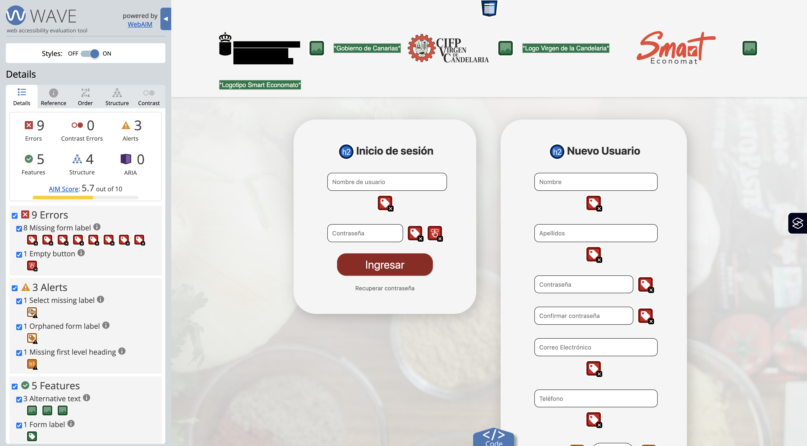

|           Detalle Errores            |        Estructura (Falta H1)         |
| :----------------------------------: | :----------------------------------: |
| 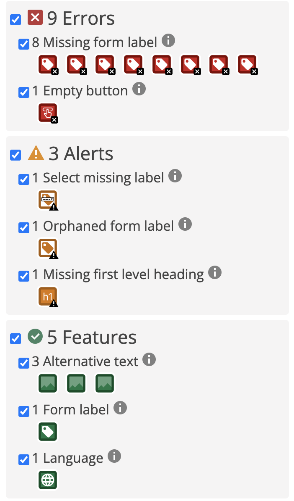 | 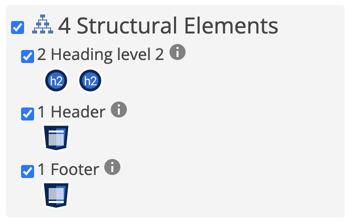 |

---

## **1.2 Auditoría con Lighthouse**

La puntuación de accesibilidad desciende a 70/100, confirmando que la página tiene carencias semánticas importantes.

- **Problemas detectados:**
  - **Etiquetado de Controles:**
    - Los botones no tienen un nombre accesible.

    - Los elementos select no tienen elementos label asociados.

  - **Estructura:**
    - El documento no tiene un punto de referencia main". Todo el contenido está envuelto en divs, lo que impide saltar al contenido principal.

  - **Contraste:**
    - Los enlaces dependen del color para distinguirse". El enlace de "Términos legales" no tiene subrayado y su color es muy similar al texto normal.

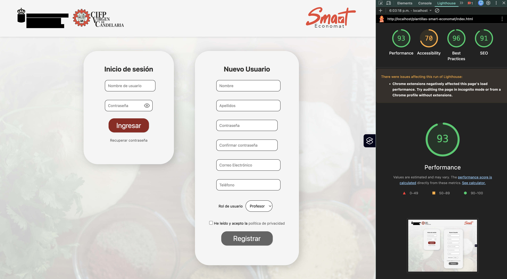

|             Performance              |               Detalles               |            Accesibilidad             | Mejores prácticas                    |
| :----------------------------------: | :----------------------------------: | :----------------------------------: | ------------------------------------ |
| 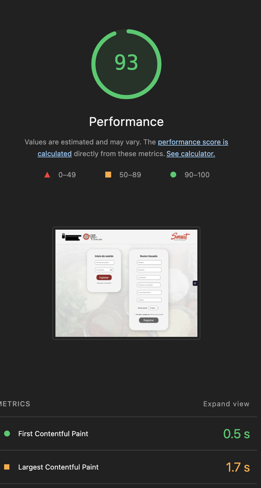 | 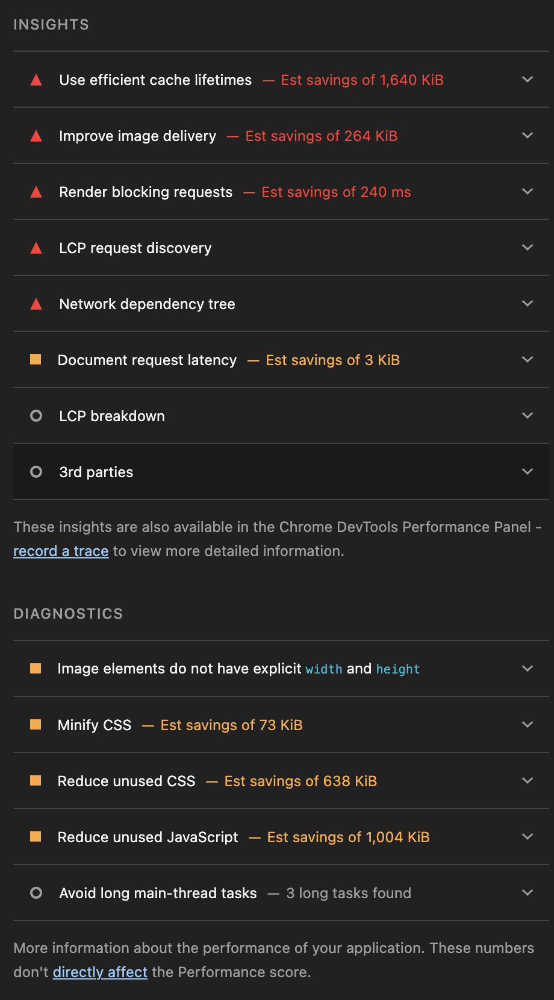 | 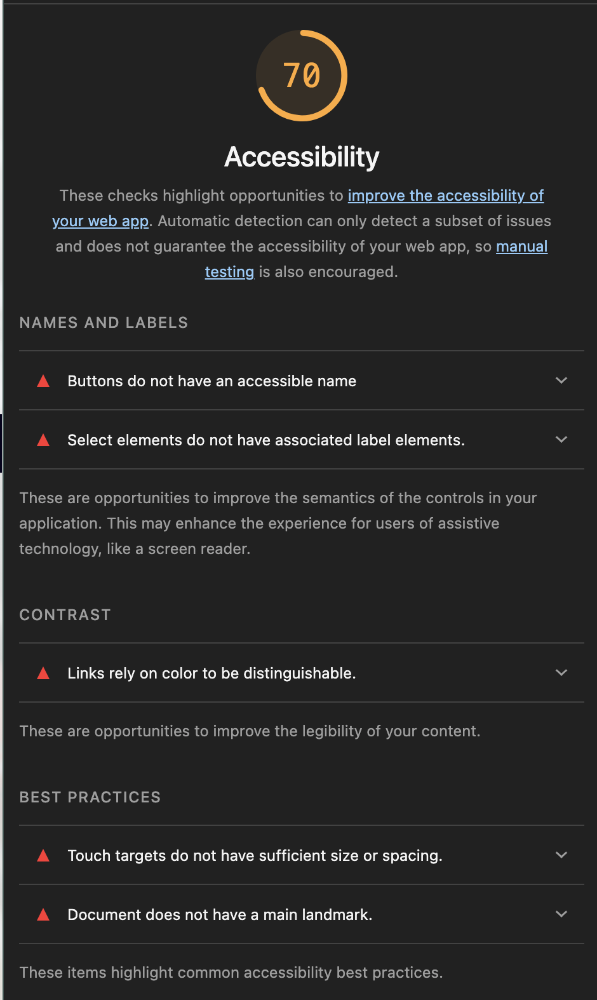 | 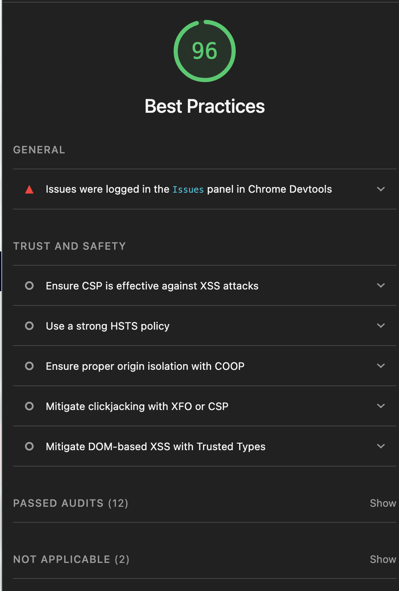 |

---

## **1.3 Auditoría con axe DevTools**

Esta herramienta proporciona el análisis más exhaustivo, detectando 21 problemas totales. Destacan por su gravedad:

- **Botones sin texto discernible (3 incidentes):** Se refiere a los botones con el icono del "ojo" (#btnTogglePassword, etc.). Al no tener texto, violan el criterio WCAG 4.1.2 (Nombre, Función, Valor).

- **Select sin nombre accesible (1 incidente):** El desplegable "Rol de usuario" (#tipoUsuario) carece de una vinculación programática con su etiqueta visual.

- **Ausencia de Regiones (Landmarks):** "El documento debe tener un punto de referencia main".

- **Enlaces indistinguibles:** Los enlaces del footer dependen únicamente del color para ser identificados, lo cual afecta a usuarios con dificultades de percepción del color.

- **Jerarquía de Encabezados:** Confirma la falta de un <h1> que identifique la página.

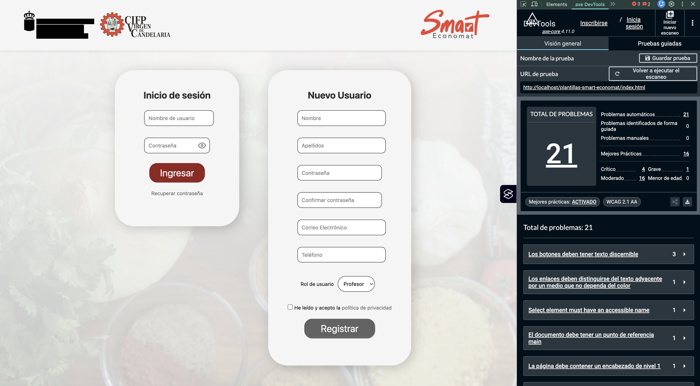

|               Botones                |               Enlaces                |                Selecs                |
| :----------------------------------: | :----------------------------------: | :----------------------------------: |
| 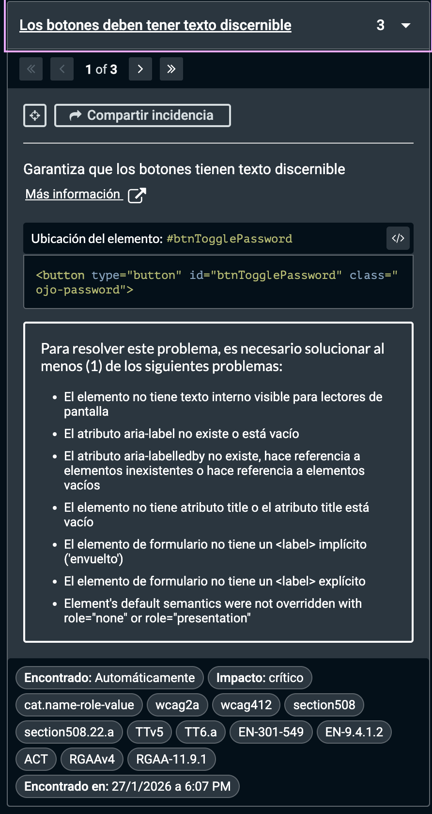 |  | 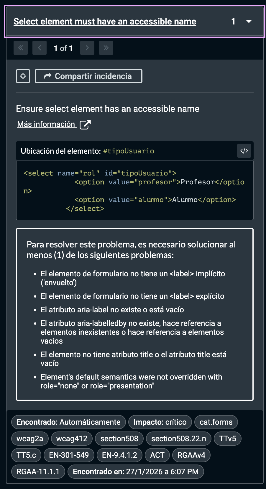 |

|            Falta de main             |             falta de h1              |         Puntos de referencia         |
| :----------------------------------: | :----------------------------------: | :----------------------------------: |
| 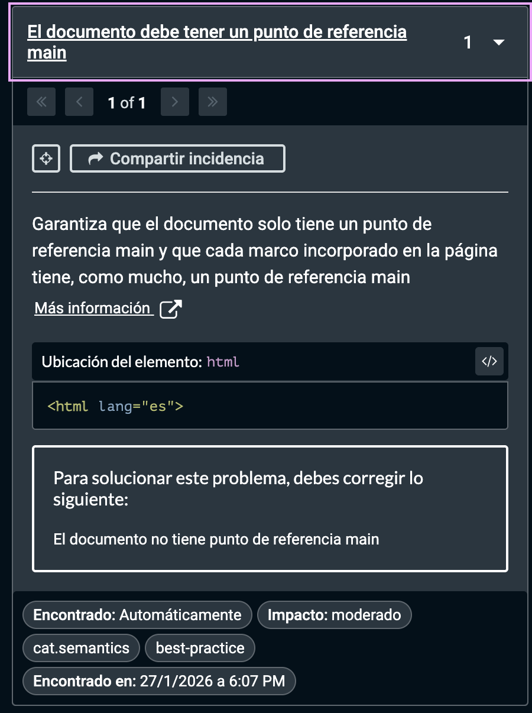 | 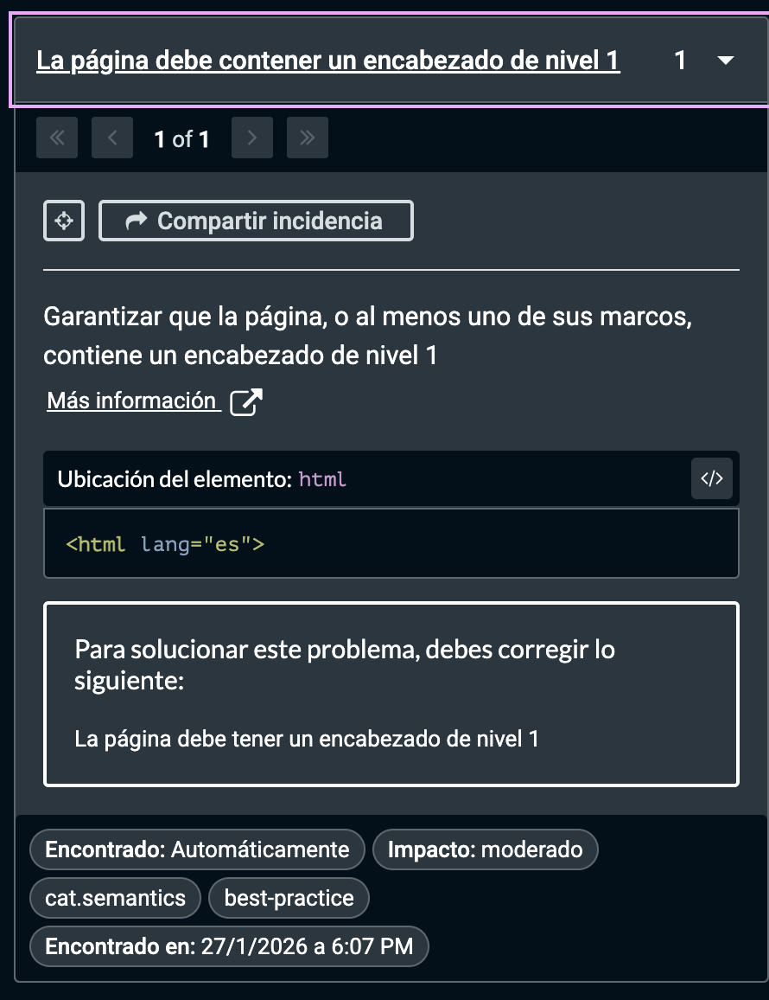 | 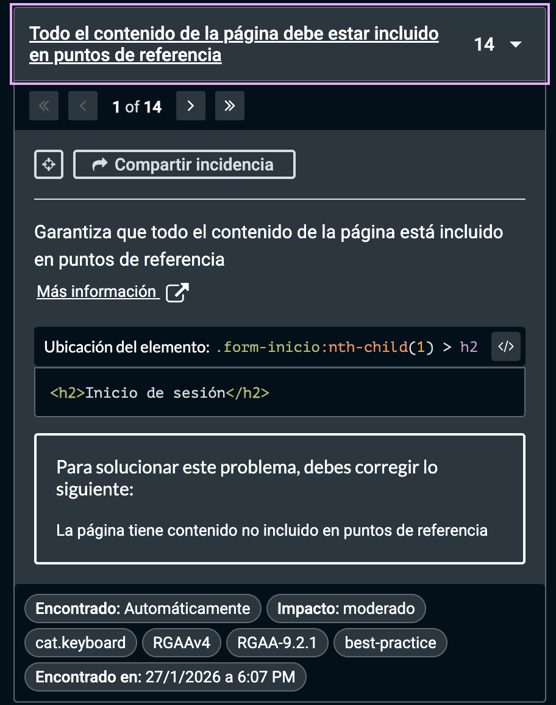 |

---

---

### **Análisis de la página de Gestión de Artículos (`articulos.html`)**

Esta vista presenta una mayor complejidad que las anteriores, ya que combina dos patrones de interfaz críticos: un **formulario extenso** para la creación de productos y una **tabla de datos** con herramientas de filtrado y búsqueda.

## **1.1 Auditoría con WAVE**

El análisis automático revela problemas severos en la identificación de los campos de formulario, lo que compromete la entrada de datos para usuarios de tecnologías de asistencia.

- **Errores Críticos:** 7 errores de tipo "Missing form label".
- **Alertas:** 6 alertas relacionadas con listas de selección (`select`) sin etiqueta.
- **Estructura:** Se detecta una tabla de datos que requiere validación manual de sus encabezados (`scope`).

**Análisis de Formulario (Nuevo Artículo):**
El formulario de registro de artículos carece de etiquetas `<label>` visibles o programáticas. Se confía enteramente en el atributo `placeholder` (ej: "Código (SKU)", "Nombre del producto"), lo cual hace que el formulario sea inaccesible una vez que el usuario comienza a escribir o si el placeholder no tiene suficiente contraste.

**Evidencias WAVE:**

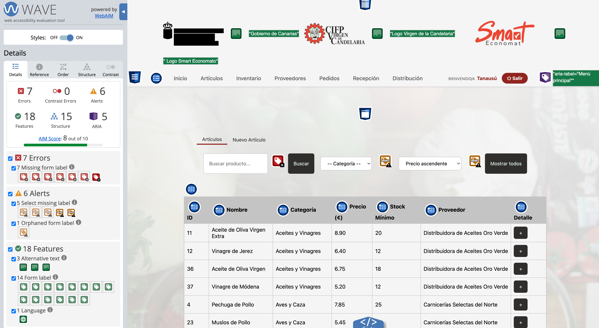

|    Detalle de Etiquetas Faltantes    |         Estructura Detectada         |
| :----------------------------------: | :----------------------------------: |
| 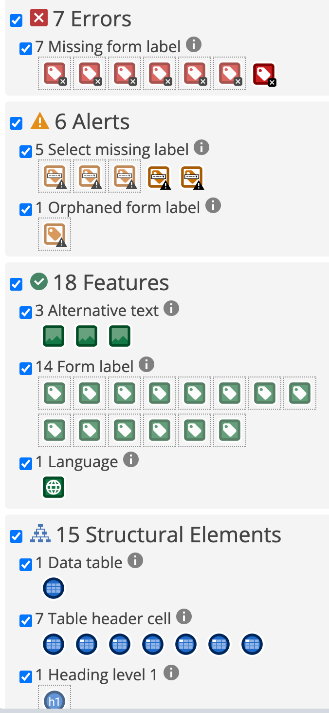 | 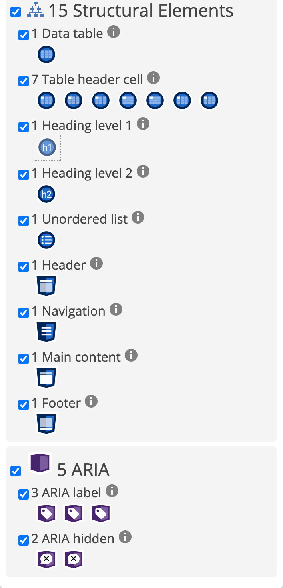 |

## **1.2 Google Lighthouse**

**Limitación Técnica:**
No ha sido posible ejecutar la auditoría de Lighthouse sobre esta vista específica debido a la arquitectura de la aplicación (Single Page Application con autenticación). Al intentar auditar la página, la herramienta fuerza una recarga que redirige al usuario a la pantalla de inicio (`home.html`), impidiendo el análisis de la vista interna.

Se procederá a validar el cumplimiento utilizando **axe DevTools** como alternativa de rigor técnico equivalente.

## **1.3 Auditoría Técnica con axe DevTools**

La herramienta Axe confirma y especifica los hallazgos de WAVE, centrando su atención en los controles de interfaz interactivos (filtros de la tabla).

**Problemas Detectados:**
Se encontraron **2 problemas automáticos críticos** relacionados con los selectores de filtrado.

- **Selectores sin nombre accesible:**
  - **Ubicación:** Filtro de categorías (`#categoriaSelect`) y filtro de orden (`#ordenSelect`).
  - **Descripción:** "Select element must have an accessible name".
  - **Impacto:** El lector de pantalla no puede anunciar el propósito del control, anunciándolo simplemente como "Combobox" o leyendo la primera opción, sin que el usuario sepa qué está filtrando.

**Evidencias Axe:**

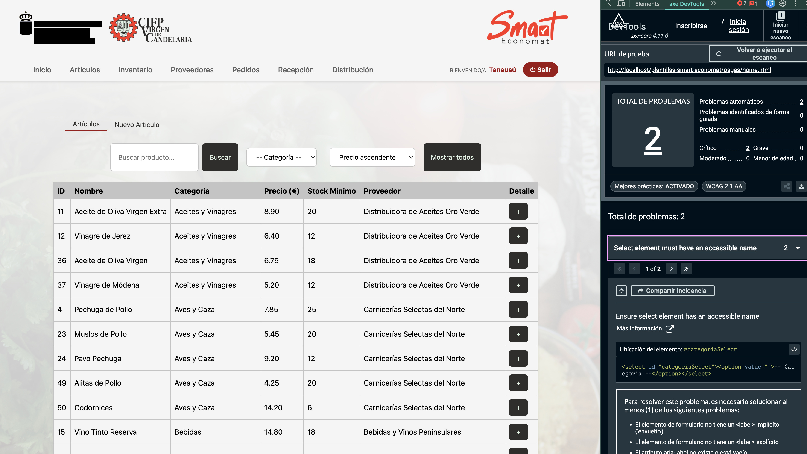

|      Error en Select Categoría       |        Error en Select Orden         |
| :----------------------------------: | :----------------------------------: |
| 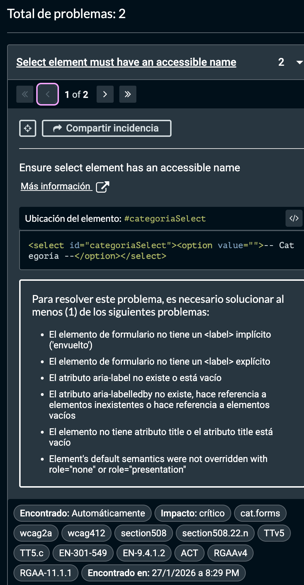 | 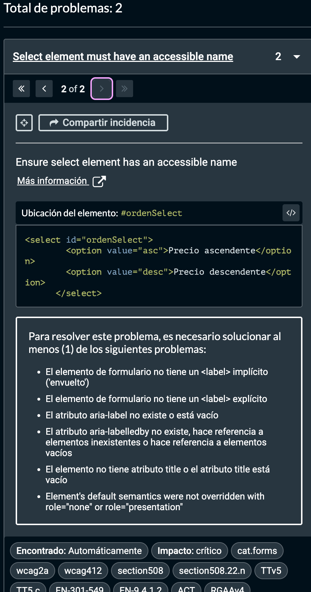 |

---

---

# **Fase 2: Mejora de la accesibilidad perceptible**

## Home

**Objetivo:** Garantizar que la información y los componentes de la interfaz sean perceptibles para todos los usuarios, independientemente de sus capacidades visuales.

### **1. Corrección de Contraste**

**Problema detectado:**
Durante la auditoría inicial, se identificó que varios colores corporativos no cumplían con el ratio mínimo de contraste exigido por las WCAG 2.1. Específicamente, el color primario (`#ea4634`) sobre fondo blanco presentaba un ratio de **3.55:1** (Fallo en nivel AA).

**Solución aplicada:**
Se han redefinido las variables CSS globales para oscurecer los tonos y maximizar la legibilidad sin perder la identidad de marca.

**Cambios realizados:**

- **Color Primario (Botones y textos):**
  - Anterior: `#ea4634`
  - Nuevo: `#922320`
  - **Resultado:** Ratio superior a **7:1** (Cumple Nivel **AAA**).

- **Color Secundario (Enlaces del footer):**
  - Anterior: `#3ad6c4`
  - Nuevo: `#35dbc8`
  - **Resultado:** Mejora significativa en la legibilidad sobre fondo oscuro.

**Validación y Herramientas:**
Se utilizó la herramienta **WhoCanUse** para validar los nuevos ratios. Esta herramienta permitió no solo verificar los datos matemáticos, sino simular la visión de personas con distintos tipos de daltonismo, asegurando que los elementos interactivos sean distinguibles para todos los usuarios.

**Evidencias de la corrección:**

| Pruebas de contraste (Color Primario) |    Pruebas de contraste (Footer)     |
| :-----------------------------------: | :----------------------------------: |
|   |  |

---

## LOGIN

**Objetivo:** Garantizar que los controles de formulario y la estructura de la página sean perceptibles por tecnologías de asistencia, resolviendo la ausencia de etiquetas de texto.

### 1. Etiquetado de Formularios (Inputs y Selects)

**Problema detectado:**
Las auditorías de WAVE y axe DevTools reportaron 9 errores críticos de "Missing form label". Los campos de entrada confiaban únicamente en el atributo `placeholder` para informar al usuario de su función. Esto provoca que los lectores de pantalla no anuncien el propósito del campo al recibir el foco, o que la instrucción desaparezca visualmente al empezar a escribir.

**Solución aplicada:**
Se han implementado etiquetas `<label>` explícitas para cada campo `input` y `select`. Para mantener el diseño visual minimalista original, se ha utilizado la técnica de ocultación accesible (clase `.sr-only`), que es invisible en pantalla pero legible para lectores de voz.

- **Técnica:** Vinculación programática mediante atributos `for` (en el label) e `id` (en el input).

**Ejemplo de corrección:**

_Código Original (Inaccesible):_

```html
<input type="text" placeholder="Nombre de usuario" ... />
```

_Código Corregido (Accesibe):_

```
<div class="cont-submit">
    <label for="nombreUsuario" class="sr-only">Nombre de usuario</label>
    <input id="nombreUsuario" type="text" placeholder="Nombre de usuario" ...>
</div>

```

### 2. Nombres Accesibles para Botones de Icono

**Problema detectado:**
Los botones interactivos para mostrar/ocultar la contraseña contenían únicamente un icono SVG. Las herramientas de auditoría los marcaron como "Empty button" y "Buttons must have discernible text", ya que no existía contenido textual que describiera su acción.

**Solución aplicada:**
Se añadió el atributo aria-label directamente al botón, proporcionando una descripción funcional clara sin alterar el diseño visual.

_Código modificado:_

```
<button title="Ver contraseña" type="button" aria-label="Mostrar u ocultar contraseña" class="ojo-password">
    <svg ...></svg>
</button>
```

---

**ARTÍCULOS**

**Objetivo:** Garantizar que los extensos formularios de gestión de inventario y las tablas de datos sean perceptibles y comprensibles para las tecnologías de asistencia.

### 1. Etiquetado de Controles de Formulario

**Problema detectado:**
Las auditorías previas (WAVE) revelaron una ausencia sistemática de etiquetas `<label>` en el formulario de "Nuevo Artículo". El diseño confiaba en el atributo `placeholder` (ej: "Código (SKU)", "Precio"), lo cual es insuficiente para usuarios de lectores de pantalla y cognitivamente demandante, ya que la instrucción desaparece al escribir.

**Solución aplicada:**
Se han inyectado etiquetas `<label>` ocultas visualmente (`.sr-only`) para cada uno de los inputs, textareas y selects del formulario. Se ha asegurado la vinculación programática estricta mediante los atributos `for` e `id`.

**Ejemplo de corrección:**

_Código Original:_

```html
<input type="text" id="codigo" placeholder="Código (SKU)" />
<div class="form-group">
  <label for="codigo" class="sr-only">Código SKU</label>
  <input type="text" id="codigo" placeholder="Código (SKU)" ... />
</div>
```

### 2. Accesibilidad en Herramientas de Filtrado

**Problema detectado:** La barra de herramientas superior (Buscador y Filtros) contenía selectores mudos. Axe DevTools marcó críticamente: "Select element must have an accessible name".

**Solución aplicada:** Se añadieron etiquetas ocultas para describir la función de cada filtro, permitiendo al usuario ciego saber exactamente qué criterio está modificando sin necesidad de deducirlo por el contexto de las opciones.

- **Buscador:** Label asociado "Buscar producto".

- **Filtro Categoría:** Label asociado "Filtrar por categoría".

- **Ordenación:** Label asociado "Ordenar listado".

---

### **2. Corrección de Semántica HTML**

**HOME**

**Problemas detectados:**

1.  **Menú de navegación inválido:** La herramienta **axe DevTools** identificó que la lista `<ul>` contenía elementos `<a>` como hijos directos, lo cual viola el estándar HTML y rompe la navegación secuencial para lectores de pantalla.
2.  **Ausencia de título principal:** No existía ningún encabezado de nivel 1 (`<h1>`), impidiendo identificar el propósito principal de la página mediante navegación por jerarquías.

**Soluciones aplicadas:**

- **Reestructuración del Menú:**
  Se invirtió el anidamiento para cumplir el estándar W3C.
  - _Incorrecto:_ `<ul> > <a> > <li>`
  - _Corregido:_ `<ul> > <li> > <a>`
    Además, se trasladaron las clases de estilo al enlace `<a>` para asegurar que el área interactiva ocupe todo el botón.

- **Encabezado Invisible H1:**
  Se solucionó la falta de título principal añadiendo un `<h1>` con la clase `.sr-only`, visible solo para lectores de pantalla, asegurando que la jerarquía del documento comience correctamente en el nivel 1.

  ```
  <h1 class="sr-only">Gestión de Economato - CIFP Virgen de Candelaria</h1>
  ```

**Resultado:**
El código ahora pasa la validación de estructura de **WAVE** y **axe DevTools**, eliminando los errores críticos de semántica.


---

**LOGIN**

**Problema detectado:**

Lighthouse y Axe indicaron dos fallos estructurales graves:

- **Falta de punto de referencia principal:** El contenido estaba envuelto en un div genérico.

- **Ausencia de encabezado:** No existía un título de nivel 1 (<h1>) que identificara la página.

- **Solución aplicada:** Se refactorizó el contenedor principal y se añadió jerarquía invisible.
  - **Región Main:** Se sustituyó el contenedor <div class="main-login"> por la etiqueta semántica <main class="main-login">.

  - **Encabezado H1:** Se añadió un título descriptivo oculto al inicio del header:

---

**ARTÍCULOS**

### Semántica de Tablas de Datos

**Problema detectado:**

La tabla de visualización de productos (#tablaProductos) carecía de definición de alcance en sus encabezados. Aunque visualmente se entendía la cabecera, los lectores de pantalla podían tener dificultades para asociar una celda de datos (ej: "8.90€") con su columna correspondiente ("Precio").

**Solución aplicada:**

Se añadió el atributo scope="col" a todos los elementos <th> dentro del <thead>. Esto refuerza la relación estructural y permite a los lectores de pantalla anunciar el encabezado al navegar por las celdas de datos.

_Código modificado:_

```html
<thead>
  <tr>
    <th scope="col">ID</th>
    <th scope="col">Nombre</th>
    <th scope="col">Categoría</th>
  </tr>
</thead>
```

---

# **Fase 3: Mejora de la accesibilidad operable**

**HOME**

**Objetivo:** Permitir que la aplicación pueda usarse sin necesidad de un ratón, garantizando el acceso mediante teclado.

### **1. Validación de Navegación por Teclado**

**Metodología:**
Se realizó una auditoría manual en la página principal (`home.html`) utilizando exclusivamente las teclas `TAB` (avanzar), `SHIFT + TAB` (retroceder) y `ENTER` (activar).

**Resultados de la prueba:**

- **Visibilidad del Foco:**

  El navegador renderiza un indicador visual (outline azul predeterminado) alrededor del elemento activo, permitiendo al usuario saber siempre dónde se encuentra.

- **Orden Lógico de Tabulación:**

  El foco sigue una secuencia coherente con la lectura visual:
  1.  Menú de Navegación en sentido correcto (Izquierda a derecha).
  2.  Botón de cierre de sesión.
  3.  Botones de acceso directo en las Tarjetas centrales.
  4.  Enlaces del pie de página.

- **Operabilidad:**
  Todos los elementos interactivos (enlaces de navegación y botones de acción) responden al evento de teclado `ENTER`, ejecutando la acción esperada (redirección o cierre de sesión).

Por tanto la página principal cumple con el criterio de operabilidad gracias al uso correcto de etiquetas semánticas HTML (`<a>`, `<button>`), sin necesidad de aplicar parches ARIA o JavaScript adicional para la navegación básica.


---

**LOGIN**

**Objetivo:** Garantizar que todos los elementos de la interfaz sean totalmente operables mediante teclado, asegurando que el usuario sepa siempre dónde está el foco.

### 1. Visibilidad del Foco (Focus Indicators)

**Problema detectado:**
Durante la auditoría manual de navegación por teclado, se detectó un fallo crítico de accesibilidad visual:

- **Botón de Ingreso:** Al recibir el foco mediante la tecla `TAB`, el botón cambiaba su estado a un fondo blanco sobre texto blanco, volviéndose visualmente invisible.

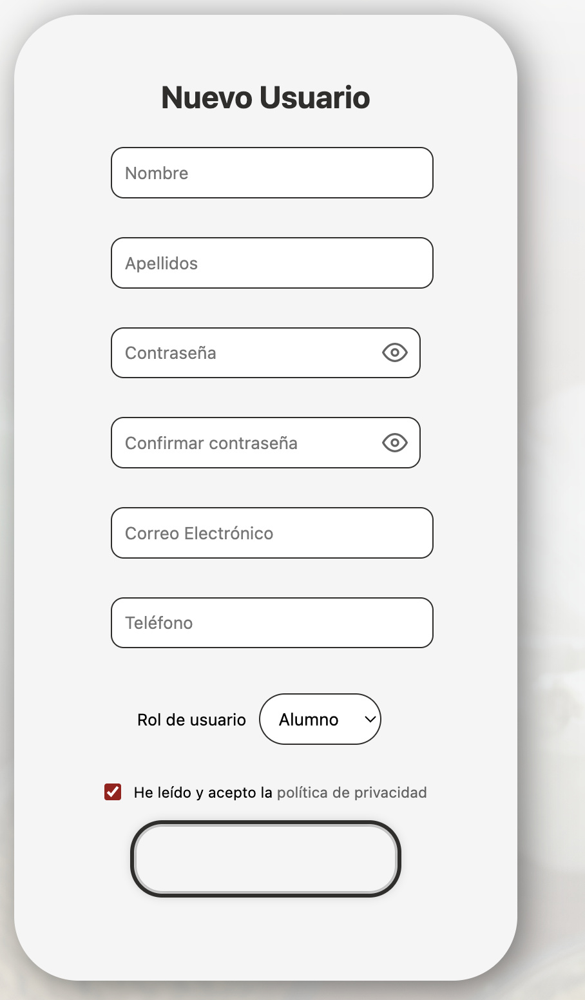

- **Selectores y Checkbox:** El selector "Rol de usuario" y el checkbox de privacidad no mostraban el anillo de enfoque predeterminado del navegador debido a la propiedad `outline: none` en la hoja de estilos, dejando al usuario de teclado a ciegas.

**Solución aplicada:**
Se realizó una intervención en el CSS (`form-styles.css`) utilizando la pseudo-clase `:focus-visible`. Se forzaron estilos de alto contraste que sobrescriben cualquier comportamiento predeterminado del navegador.

- **Botones:** Se aplicó un borde negro sólido de 4px con separación (`outline-offset`) y se forzó el color de fondo corporativo para evitar el "efecto fantasma".

- **Inputs y Selects:** Se restauró el anillo de enfoque visual utilizando el color primario de la marca.

**Código CSS implementado:**

```css
/* Corrección de Visibilidad del Foco */
.btn-submit:focus-visible {
  background-color: var(--primary-color) !important;
  color: var(--cl-white) !important;
  outline: 4px solid #000000 !important; /* Borde de alto contraste */
  outline-offset: 3px !important;
}

select:focus-visible,
input[type="checkbox"]:focus-visible {
  outline: 2px solid var(--primary-color) !important;
}
```

### 2. Orden de Navegación y Lógica

**Verificación:**

Se comprobó la secuencia de navegación para asegurar que no existieran "trampas de teclado" ni saltos ilógicos.

- **Secuencia:** El foco avanza de forma coherente: Usuario → Contraseña → Botón Ojo → Botón Ingresar.

- **Interactividad:** Se validó que los botones interactivos (como el icono para mostrar contraseña) son accionables mediante las teclas Enter y Espacio, permitiendo su uso sin necesidad de ratón.

- **Resultado:** La página de Login es ahora 100% operable por teclado. El indicador de foco es claramente visible en todos los controles, cumpliendo con los requisitos de accesibilidad web para usuarios con discapacidad motora o visual.

### 3. Evidencias de Operabilidad

|            Orden correcto            |          Botones operativos          |          checkbox operativo          |
| :----------------------------------: | :----------------------------------: | :----------------------------------: |
| 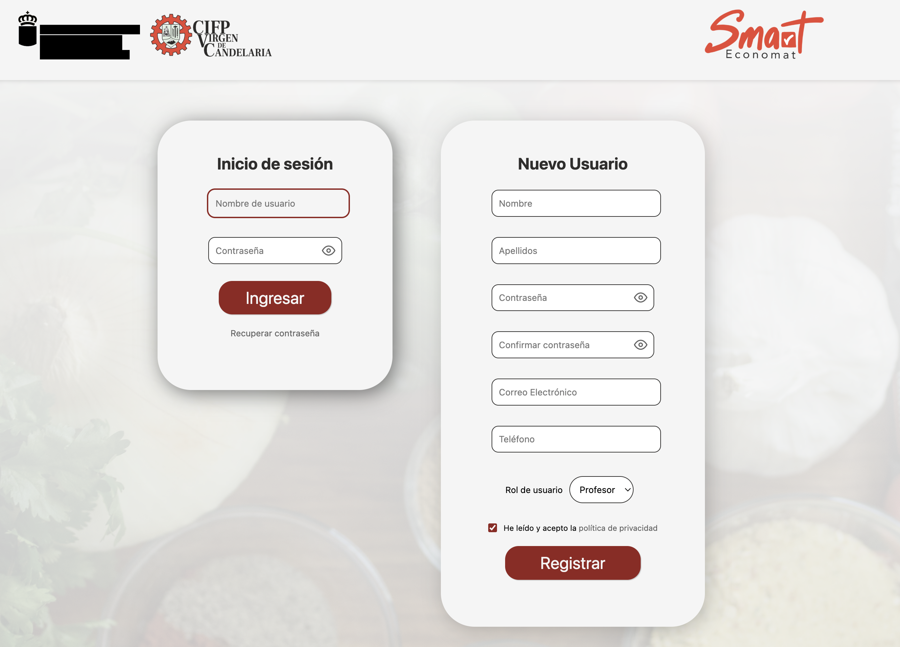 | 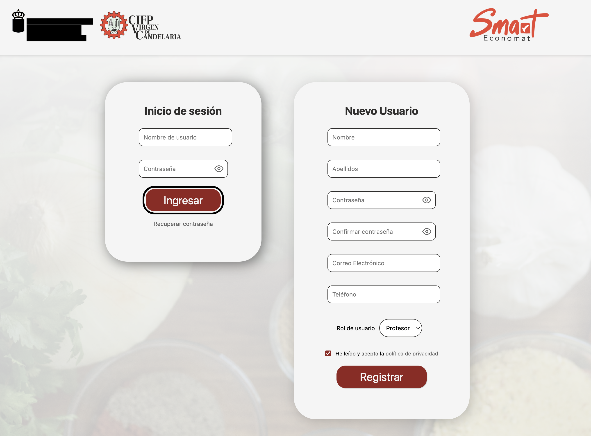 | 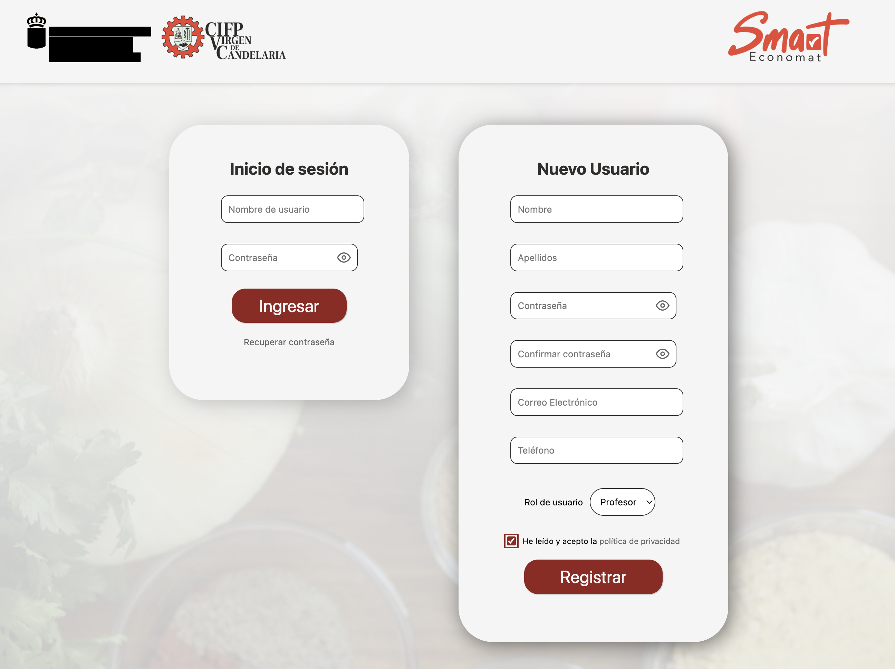 |

---

---

**ARTICULOS**

**Objetivo:** Verificar que la compleja interfaz de gestión (pestañas, tablas y formularios extensos) sea totalmente funcional mediante el uso exclusivo del teclado.

### 1. Adaptación de Navegación por Pestañas (Tabs)

**Problema detectado:**
El sistema original de pestañas estaba basado en elementos de lista (`<li>`) gestionados únicamente por eventos de ratón. Esto impedía que los usuarios de teclado pudieran enfocar o activar las pestañas, bloqueando el acceso a la función de "Nuevo Artículo".

**Solución aplicada:**
Se realizó una refactorización completa del componente de navegación:

1.  **Estructura Semántica:** Se sustituyeron los `<li>` por elementos `<button role="tab">`, que son interactivos por defecto.
2.  **Estilos de Foco (CSS):** Se adaptó la hoja de estilos (`submenu.css`) para incluir la pseudo-clase `:focus-visible`. Ahora, al tabular sobre las pestañas, aparece un indicador visual de alto contraste (borde negro sólido) que no existía anteriormente.
3.  **Lógica de Activación:** Se verificó que las pestañas responden a las teclas `ENTER` y `ESPACIO`, cambiando el panel visible (`role="tabpanel"`) correctamente.

### 2. Orden de Tabulación en el Formulario

**Verificación:**
Se validó la secuencia de foco en el formulario de creación de artículos. El cursor sigue un orden lógico:

1.  Datos de cabecera (Inputs superiores).
2.  Descripción y selectores intermedios.
3.  Matriz de alérgenos (navegación secuencial por checkboxes).
4.  Botón final de registro.

No se detectaron trampas de teclado que impidan al usuario salir de ninguna sección.

### 3. Visibilidad del Foco en Controles

**Solución aplicada:**
Se extendieron las reglas de accesibilidad visual a los nuevos elementos interactivos:

- **Filtros de Tabla:** Los desplegables de categoría y ordenación muestran ahora el anillo de foco corporativo.
- **Botones de Acción:** El botón `.registrarArticulo` hereda los estilos de foco visibles definidos globalmente.

**Resultado:**
La página de Artículos cumple con el criterio de Operabilidad, permitiendo la gestión completa del inventario sin depender del ratón.

### 3. Evidencias de Operabilidad

|         Tab con focus activo         |       Navegacion a la pestaña        |         Navegación ordenada          |
| :----------------------------------: | :----------------------------------: | :----------------------------------: |
| 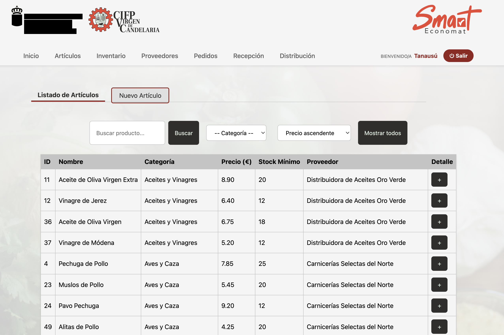 | 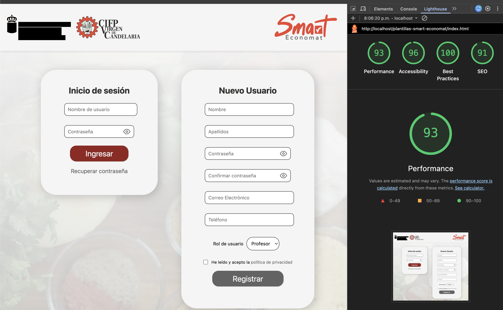 | 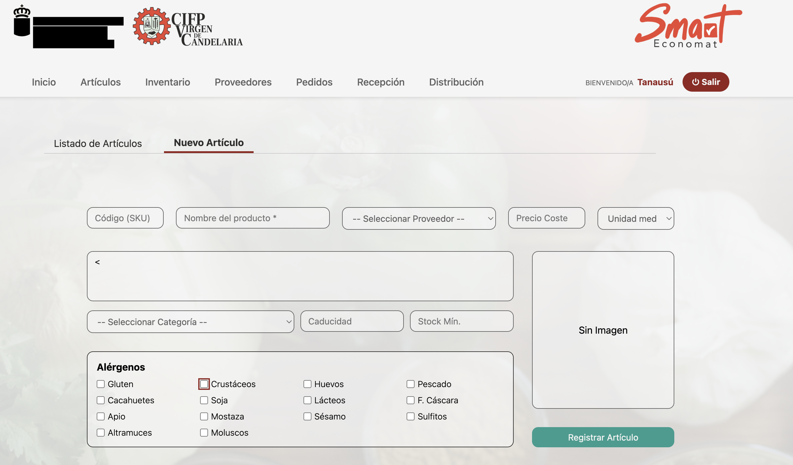 |

---

# **Fase 4: Mejora de la accesibilidad comprensible**

**Objetivo:** Facilitar la comprensión del contenido y asegurar que el navegador interprete correctamente el idioma de la página.

### **1. Definición de Idioma y Etiquetas**

**Verificación:**

- **Idioma del Documento:**
  La etiqueta raíz `<html lang="es">` está definida explícitamente. Esto permite que los lectores de pantalla carguen la síntesis de voz en español automáticamente y realicen la corrección ortográfica adecuada.

```

  <!doctype html>
  <html lang="es">
```

- **Claridad en Controles:**
  Se ha verificado que los botones que utilizan iconos (como el de "Salir") incluyen atributos textuales de apoyo.
  - _Elemento:_ Botón de Logout.
  - _Atributo:_ `title="Cerrar Sesión"`.
  - _Beneficio:_ Proporciona una etiqueta accesible que aclara la función del botón más allá del texto visual "Salir".

```
    <button id="btnLogout" class="bt-logout" title="Cerrar Sesión">
              ⏻ Salir
    </button>
```

# **Fase 5: Mejora de la accesibilidad robusta**

**Objetivo:** Asegurar la compatibilidad con tecnologías de apoyo actuales y futuras mediante el uso estricto de estándares web semánticos y especificaciones ARIA.

### **1. Auditoría de Estructura Semántica**

**Estado inicial:**
Se verificó el código fuente del proyecto (`home.html`), confirmando que la estructura base ya cumplía parcialmente con los estándares de HTML5. Las regiones principales estaban correctamente definidas mediante las etiquetas:

- `<header>`: Para la cabecera y logotipos.
- `<main>`: Para el contenedor del contenido principal.
- `<footer>`: Para el pie de página y créditos.

**Deficiencia detectada:**
A pesar de la correcta estructura general, se identificó que el **menú de navegación** estaba implementado mediante un contenedor genérico (`div`), rompiendo la cadena semántica y ocultando esta región clave a los lectores de pantalla.

### **2. Correcciones y Mejoras de Robustez**

Para perfeccionar la estructura y garantizar la robustez, se aplicaron las siguientes mejoras:

- **Implementación de `<nav>`:**
  Se sustituyó el `div` de la navegación por la etiqueta semántica `<nav>`. Esto permite que el navegador exponga correctamente el rol "navigation" al árbol de accesibilidad.

- **Etiquetado de Regiones:**
  Aunque las etiquetas `main` y `footer` ya existían, se les añadieron atributos `aria-label` para desambiguar su propósito en contextos de lectura rápida:
  - `<nav aria-label="Principal">`: Diferencia esta navegación de otras listas de enlaces.
  - `<footer aria-label="Información legal">`: Describe el contenido del pie de página.

**Resultado:**
La aplicación cuenta ahora con una estructura 100% semántica, validada tanto por herramientas automáticas como por la inspección de código manual.

---

**ARTÍCULOS**

**Objetivo:** Asegurar la compatibilidad con tecnologías de apoyo actuales y futuras mediante el uso estricto de estándares web y especificaciones ARIA para componentes dinámicos.

### 1. Implementación del Patrón ARIA para Pestañas (Tabpanel)

**Situación:**
La página utiliza un sistema de navegación por pestañas (Listado y Nuevo Artículo) que no existe como elemento nativo en HTML. Para garantizar su robustez, se implementó manualmente el patrón de diseño **WAI-ARIA Tabs**.

**Intervención Técnica:**
Se añadieron los roles y atributos necesarios para que los lectores de pantalla interpreten correctamente la estructura dinámica:
* **`role="tablist"`:** Define el contenedor de los botones como una lista de pestañas.
* **`role="tab"`:** Identifica a cada botón como una pestaña interactiva.
* **`aria-selected="true/false"`:** Atributo gestionado vía JavaScript que informa al navegador de qué pestaña está activa en cada momento, sin necesidad de recargar la página.
* **Gestión de Estados:** Se asegura que el cambio visual (`display: none/block`) vaya acompañado de una actualización en el árbol de accesibilidad.

### 2. Validación Nativa de Formularios (HTML5)

**Mejora de Robustez:**
En lugar de depender exclusivamente de scripts personalizados para validar los datos (que pueden fallar si JS está deshabilitado o dar errores de compatibilidad), se optó por la validación nativa del navegador.
* **Tipos de Datos:** Uso de `type="number"` y `step="0.01"` para precios. Esto permite que el navegador exponga una interfaz numérica optimizada en móviles y valide el formato decimal automáticamente.
* **Atributos `required`:** El uso del atributo estándar garantiza que el navegador impida el envío de datos incompletos de forma consistente en cualquier plataforma.

### 3. Estructura de Datos Tabulares

**Corrección Semántica:**
Se aseguró la robustez de la tabla de inventario mediante la definición explícita del ámbito de las celdas.
* **Uso de `scope="col"`:** Garantiza que, incluso si la tabla se renderiza en modos de alto contraste o se convierte a texto plano por un lector braille, la asociación entre el encabezado "Precio" y el dato "8.90€" se mantenga intacta.

**Conclusión de la Fase:**
El código de la sección de Artículos es ahora semánticamente rico y cumple con los estándares técnicos, asegurando su funcionamiento en múltiples agentes de usuario.

# **Fase 6: Pruebas con lectores de pantalla y validación manual**

**HOME**

**Objetivo:** Verificar la experiencia de usuario real utilizando herramientas de simulación de lectores de pantalla, detectando problemas semánticos y de contexto que las auditorías automáticas no pueden identificar.

### **1. Metodología de Prueba**

Para esta fase, se prescindió del ratón y se utilizó la herramienta **Silktide** que tiene una opción de simulador de lector de pantalla para navegar por la interfaz auditiva. El objetivo fue comprobar si el orden de lectura, la identificación de regiones y los nombres de los controles eran comprensibles sin referencias visuales.

### **2. Problemas Detectados y Correcciones**

Durante la navegación simulada, se identificaron cuatro problemas críticos de experiencia de usuario que fueron corregidos inmediatamente:

#### A. Ausencia de Región de Navegación ("Div Soup")

- **Problema:** El lector de pantalla no anunciaba la región del menú principal. Al estar envuelto en un `<div>`, el lector lo interpretaba como texto plano, obligando al usuario a recorrer todos los enlaces uno por uno para saber qué eran.
- **Corrección:** Se sustituyó el contenedor `<div>` por la etiqueta semántica `<nav>`.
- **Resultado:** El lector ahora anuncia _"Entered navigation"_ (Entrando en navegación), permitiendo al usuario saltar directamente a esta zona o saltársela si lo desea.

#### B. Inconsistencia Semántica en SPA (Single Page Application)

- **Problema:** Se detectó que asignar una etiqueta específica (`aria-label="Accesos directos"`) al contenedor `<main>` era un error en una arquitectura SPA. Al navegar a otras vistas (como Pedidos o Inventario), la etiqueta "Accesos directos" persistía aunque el contenido hubiera cambiado, confundiendo al usuario.
- **Corrección:** Se asignó una etiqueta genérica `aria-label="Contenido principal"` al contenedor maestro.
- **Estrategia:** La identificación del contexto específico se delega ahora a los encabezados (`<h2>`) que se cargan dinámicamente dentro de cada vista.

**aria-label para el main**

```
<main id="contenido" aria-label="Contenido principal">
```

**<h2> para identificar las páginas internas dentro del main**

```
<h2 class="sr-only">Accesos directos</h2>
```

#### C. Ausencia de Título de Página (H1)

- **Problema:** El usuario auditivo no recibía confirmación del nombre de la aplicación al cargar la página.
- **Corrección:** Se implementó un `<h1>` con la clase `.sr-only`, visible solo para lectores de pantalla.
- **Resultado:** El lector anuncia _"Heading 1 - Smart Economato - Panel de Control Principal"_ al inicio de la navegación.

### **3. Resultado final**

La prueba manual evidenció que un código HTML visualmente correcto puede ser inutilizable auditivamente. La implementación de las etiquetas semánticas (`nav`, `main`) y los atributos ARIA correctos transformaron una lista de enlaces desordenada en una interfaz estructurada y navegable por regiones.

### **4. Evidencias de Validación**

A continuación se muestra la captura del simulador Silktide reconociendo correctamente la región de navegación y leyendo la lista de elementos tras las correcciones aplicadas.

|           Lectura de _h1_            |          Lesctura del _nav_          |      lectura de _link_ (footer)      |
| :----------------------------------: | :----------------------------------: | :----------------------------------: |
|  |  |  |

**LOGIN**

# Fase 6: Pruebas con Lectores de Pantalla (Login)

**Objetivo:** Verificar la experiencia de usuario en el formulario de acceso, detectando problemas de "ruido semántico" o controles sin etiqueta que las herramientas automáticas no reportaron.

### 1. Metodología y Problemas Detectados

Se utilizó el simulador de lector de pantalla **Silktide** para recorrer el flujo de inicio de sesión y registro. La prueba manual reveló **tres barreras críticas de experiencia de usuario** que impedían una navegación fluida:

#### A. Botones de Acción Mudos ("No accessible text")

- **Detección:** El simulador reportó el error _"No accessible text was found 'Button'"_ al intentar leer los botones principales de "Ingresar" y "Registrar".
- **Causa:** La implementación original utilizaba `<input type="submit" value="...">`. En ciertos contextos de renderizado accesible, el atributo `value` no se exponía correctamente como nombre accesible, dejando al usuario con un anuncio genérico de "Botón" sin saber para qué servía.
- **Corrección:** Se refactorizaron los controles utilizando la etiqueta estándar `<button type="submit">Texto</button>`, garantizando que el texto sea contenido explícito del elemento.

- **Evidencia del fallo:**

|       Botón Ingresar sin texto       |      Botón Registrar sin texto:      |
| :----------------------------------: | :----------------------------------: |
|  | 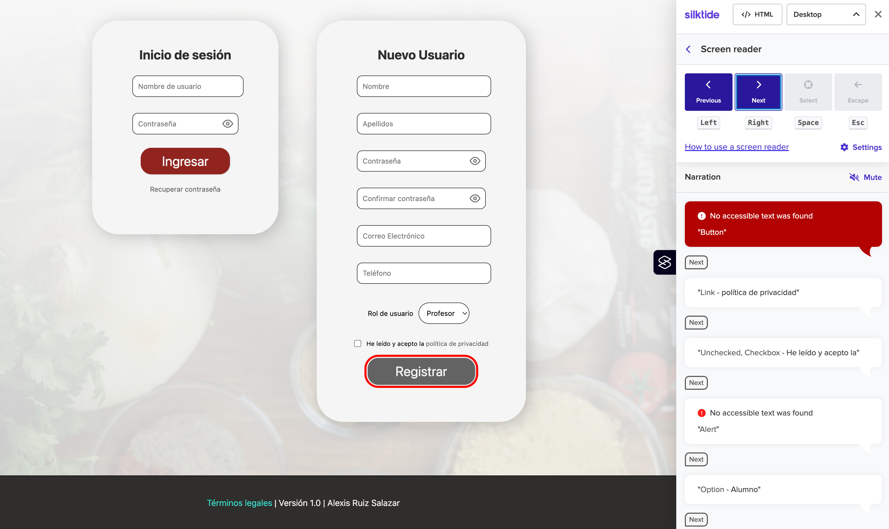 |

#### B. Alertas Fantasmas (Empty Alerts)

- **Detección:** El simulador reportó múltiples errores de tipo _"No accessible text was found - Alert"_ bajo los campos de contraseña y usuario.
- **Causa:** Los contenedores de mensajes de error (`<p role="alert"></p>`) existían en el HTML pero estaban vacíos esperando validación JS. Los lectores detectaban la región de "Alerta" pero, al no haber texto, generaban confusión.
- **Corrección:** Se aplicó la regla CSS `.error:empty { display: none; }` para ocultar estos elementos del Árbol de Accesibilidad hasta que contengan un mensaje real.

|           Alerta fantasma            |           Alerta fantasma            |
| :----------------------------------: | :----------------------------------: |
| 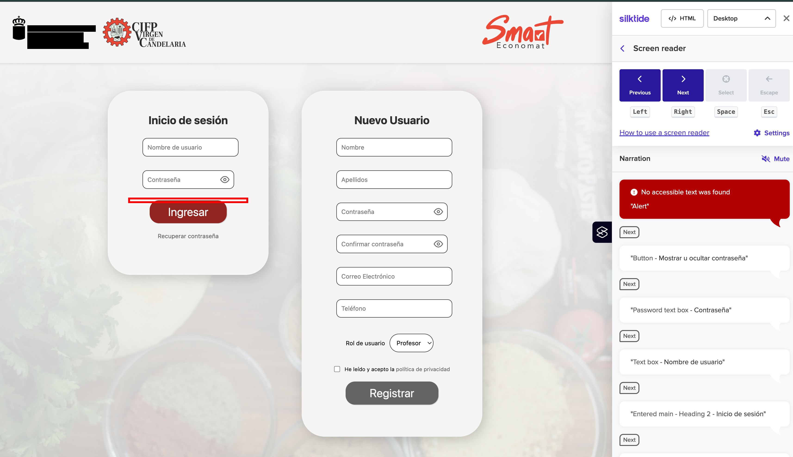 | 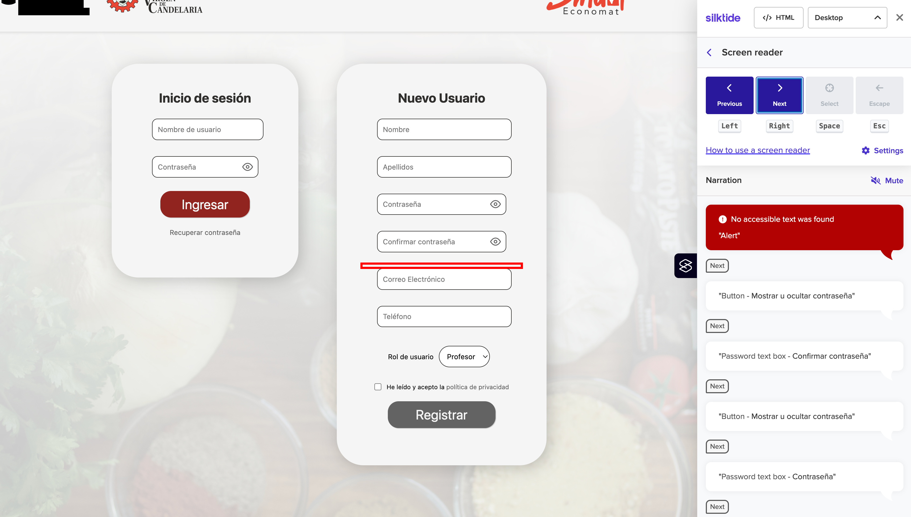 |

#### E. Lectura Fragmentada en Checkbox Legal

- **Detección:** Al navegar al checkbox de consentimiento, el lector de pantalla leía solo la parte de texto plano ("He leído y acepto la") y hacía una pausa o separaba el enlace ("política de privacidad"), perdiendo el contexto de la frase completa.
- **Causa:** La etiqueta `<label>` contenía un elemento interactivo anidado (`<a>`), lo que fragmentaba el árbol de accesibilidad en algunos lectores.
- **Corrección:** Se añadió el atributo `aria-label="He leído y acepto la política de privacidad"` al elemento `<input type="checkbox">`. Esto fuerza al lector a anunciar la frase completa de una sola vez cuando el foco está en la casilla, independientemente de la estructura visual.

### 2. Resultado tras las correcciones

Tras la refactorización a etiquetas `<button>` y la limpieza de alertas vacías mediante CSS, la navegación auditiva es coherente:

1.  El lector anuncia correctamente "Botón - Ingresar".
2.  No se detiene en líneas vacías o alertas inexistentes.
3.  El flujo de tabulación es limpio y descriptivo.

---

# **Fase 7: Auditoría Final y Validación**

**HOME**

**Objetivo:** Verificar que, tras la implementación de las medidas correctoras (Fases 2-6), la aplicación cumple rigurosamente con los estándares técnicos exigidos.

### **1. Validación Estructural**

Se realizó un escaneo final sobre el archivo `home.html` refactorizado. La herramienta certifica la ausencia total de incidencias.

- **Errores:** 0
- **Errores de Contraste:** 0
- **Alertas:** 0
- **Estructura:** Se validó la correcta jerarquía de encabezados (`h1`, `h2`) y regiones semánticas.

**Evidencia:**


### 2. Validación de Rendimiento

La auditoría de Google Chrome Lighthouse confirma la optimización total, alcanzando la máxima puntuación posible.

- **Puntuación Accesibilidad:** **100/100**
- **Verificaciones superadas:** Navegación por teclado, etiquetado ARIA, contraste de color y nombres accesibles.

**Evidencia:**


### 3. Validación de Motor de Reglas

Como medida de control de calidad adicional, se ejecutó el motor de análisis `axe-core`.

- **Total de problemas:** 0
- **Cumplimiento:** WCAG 2.1 AA y mejores prácticas recomendadas.

**Evidencia:**


**LOGIN**

**Objetivo:** Certificar el cumplimiento técnico de la página de acceso (`index.html`) tras la refactorización de formularios, estructura y navegación.

### 1. Validación Estructural (WAVE)

El escaneo final con WAVE confirma que se han eliminado todas las barreras de entrada en los formularios.

- **Errores:** 0 (Se corrigieron los 9 errores iniciales de etiquetas faltantes).
- **Alertas:** 0
- **Características ARIA:** 13 (Uso correcto de `aria-label` en botones de iconos y `role="alert"` gestionados).

**Evidencia:**
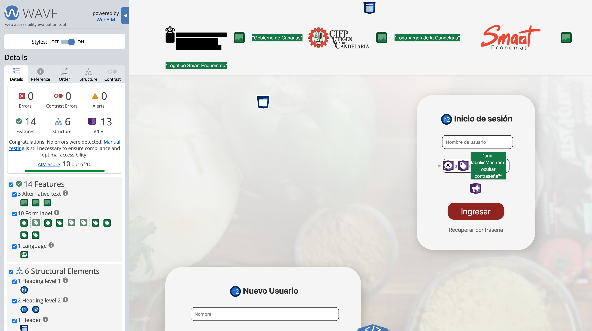

### 2. Validación de Rendimiento (Lighthouse)

La auditoría de Google Chrome arroja ahora una puntuación perfecta en accesibilidad, validando que los controles de formulario tienen nombres accesibles y el contraste es adecuado.

- **Puntuación Accesibilidad:** **100/100**
- **Mejoras validadas:** Nombres de botones, etiquetas de formulario y gestión del foco.

**Evidencia:**


### 3. Validación Técnica (axe DevTools)

El motor Axe, que inicialmente detectó 21 problemas graves, ahora certifica una limpieza total del código.

- **Total de problemas:** 0
- **Estado:** Cumplimiento estricto de WCAG 2.1 Nivel AA.

**Evidencia:**
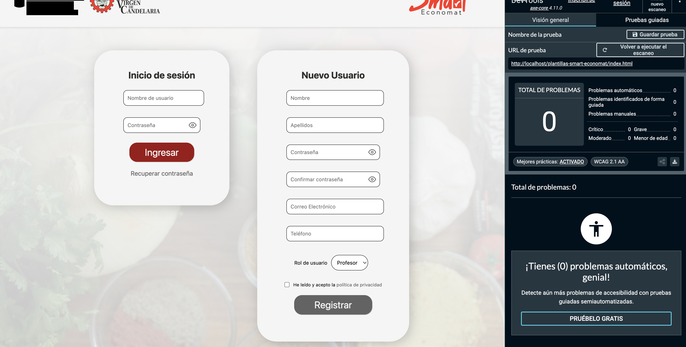

---

# Conclusiones del Proyecto

La intervención realizada en la aplicación Smart Economato ha permitido transformar una interfaz con barreras de acceso significativas en un producto web inclusivo, robusto y con buenas prácticas.

**Resumen de Logros:**

1.  **Perceptibilidad (Nivel AAA):** Corrección total de la paleta de colores, garantizando ratios de contraste superiores a 7:1 para una legibilidad óptima.
2.  **Robustez Semántica:** Migración de una estructura basada en `<div>` a HTML5 semántico (`nav`, `main`, `header`), permitiendo la correcta interpretación por parte del Árbol de Accesibilidad del navegador.
3.  **Experiencia de Usuario Inclusiva:** Solución de problemas de contexto auditivo detectados mediante pruebas manuales con lectores de pantalla.
4.  **Operabilidad Total:** Garantía de navegación 100% funcional mediante teclado, ideal para usuarios con discapacidad motora.

**Estado Final:**
La página de inicio (`home.html`) y del login (`index.html`)n cumple satisfactoriamente con los Criterios de Conformidad de las **WCAG 2.1**, validadas mediante una triangulación de herramientas líderes en la industria (WAVE, Lighthouse y Axe).
