# Auditoría de Accesibilidad - Smart Economato

## Fase 1: Auditoría Inicial

**Objetivo:** Conocer el estado real del proyecto antes de intervenir y registrar los problemas detectados.

A continuación se detalla la auditoría inicial realizada sobre el proyecto Smart Economato. Para evaluar el cumplimiento de las pautas de accesibilidad, se han utilizado herramientas automáticas sobre la página principal y los elementos clave de la interfaz.

### **1.1 Auditoria con WAVE Web Accessibility Evaluation Tool**

### **Análisis de la Página Principal (`home.html`)**

Se ha realizado un análisis automático detectando los siguientes problemas prioritarios:

#### **1. Errores de Contraste**

- **Cantidad:** 9 errores detectados.
- **Descripción:** La herramienta indica que el contraste entre el texto y el fondo es "Muy bajo".
- **Causa:** La combinación de los colores corporativos (fondo rojo/naranja) con texto blanco de tamaño pequeño no alcanza el ratio mínimo exigido por las pautas WCAG AA (4.5:1).
- **Impacto:** Dificulta la lectura para usuarios con baja visión o en condiciones de mucha luz.

#### **2. Estructura del Documento**

- **Cantidad:** 1 alerta crítica.
- **Descripción:** Ausencia de estructura de encabezados.
- **Detalle:** La página no contiene etiquetas `<h1>` a `<h6>`.
- **Impacto:** Los usuarios de lectores de pantalla no pueden navegar por secciones ni entender la jerarquía de la información, ya que todo el texto se percibe plano.

#### **3. Imágenes y Texto Alternativo**

- **Observación:** Se detectaron 6 imágenes con texto alternativo nulo o vacío.
- **Acción requerida:** Se revisará manualmente en la siguiente fase para asegurar que las imágenes decorativas estén ocultas correctamente y las informativas tengan descripción.

### **Evidencias**

A continuación se muestran las capturas de la auditoría obtenida con la aplicación WAVE

| 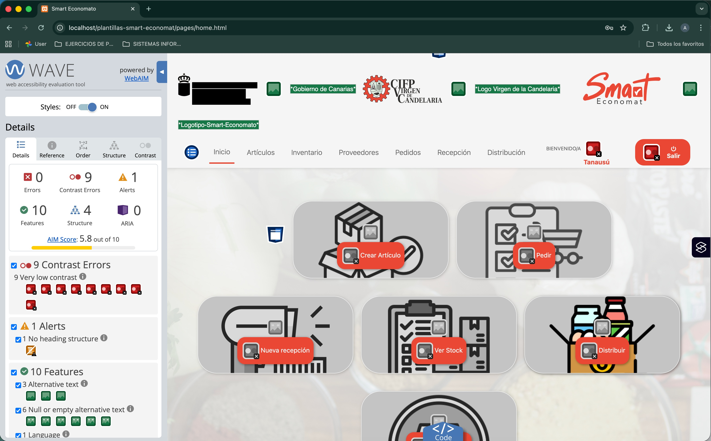 |

|        Errores de Contraste         |      Estructura (Encabezados)       |     Características (Imágenes)      |
| :---------------------------------: | :---------------------------------: | :---------------------------------: |
| 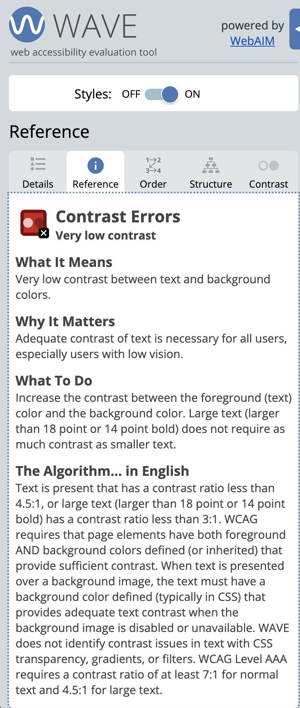 | 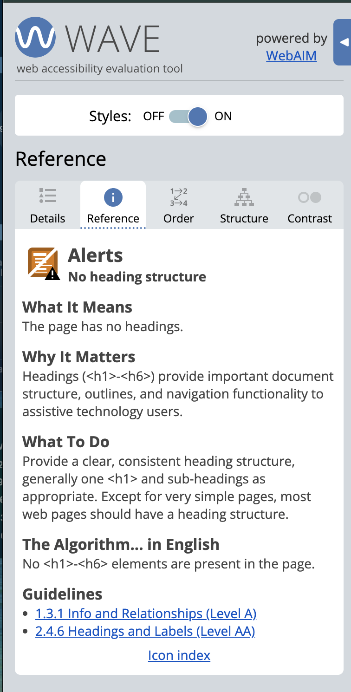 | 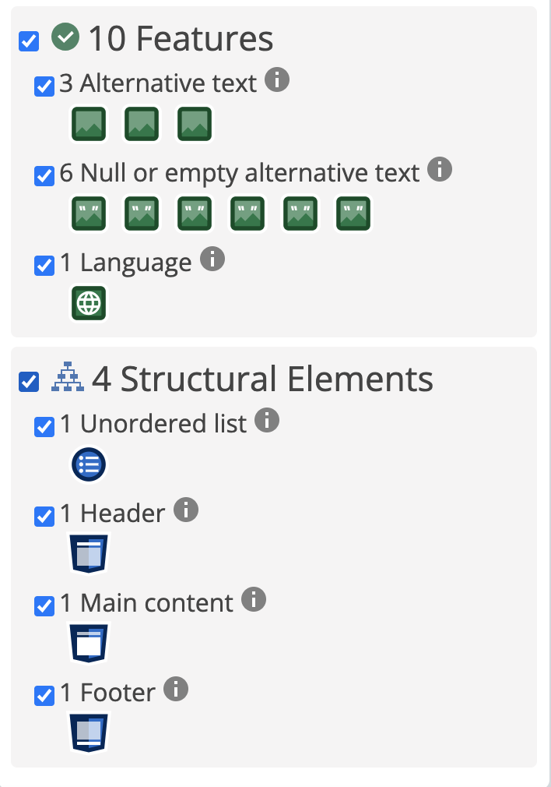 |

---

### **1.2 Auditoria con Lighthouse**

### **Análisis**

Para validar los resultados, se ejecutó una segunda auditoría utilizando las herramientas Lighthouse.

**Resumen de Puntuaciones:**

- **Performance** 90/100
- **Accesibilidad:** 80/100
- **Buenas Prácticas:** 96/100
- **SEO:** 91/100.

**Puntos a tratar**

1.  **Contraste:** Lighthouse confirma el diagnóstico de WAVE: "Los colores de fondo y de primer plano no tienen una relación de contraste suficiente".

2.  **Problemas Estructurales Nuevos:** Se detectaron errores en la estructura de listas HTML:
    - Elementos de lista `<li>` que no están dentro de un padre `<ul>` o `<ol>`.
    - Listas que contienen elementos no permitidos.

### **Evidencias**

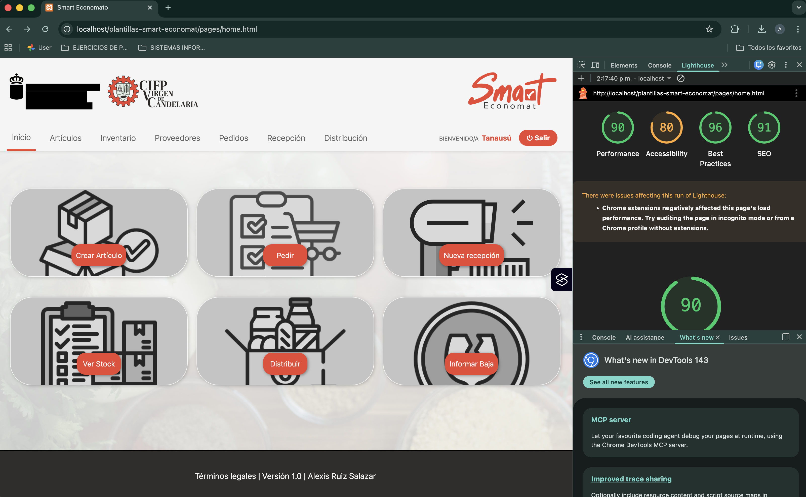

|             Performance             |            Accesibilidad            |          Buenas Prácticas           |                 SEO                 |
| :---------------------------------: | :---------------------------------: | :---------------------------------: | :---------------------------------: |
| 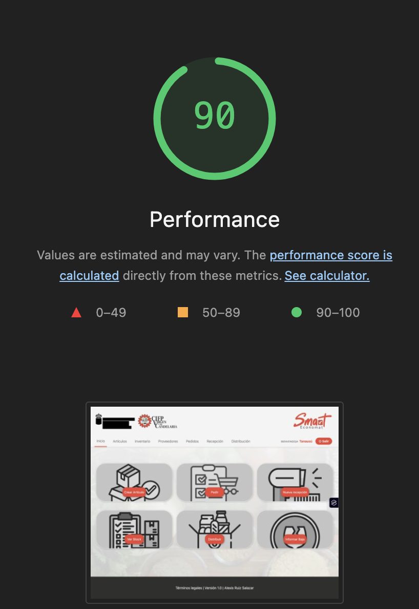 | 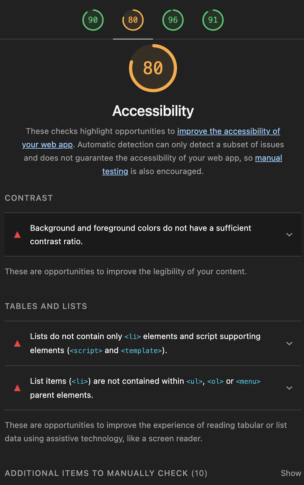 | 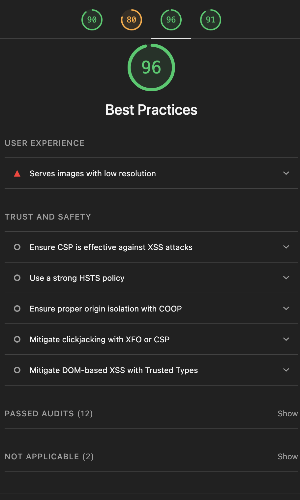 | 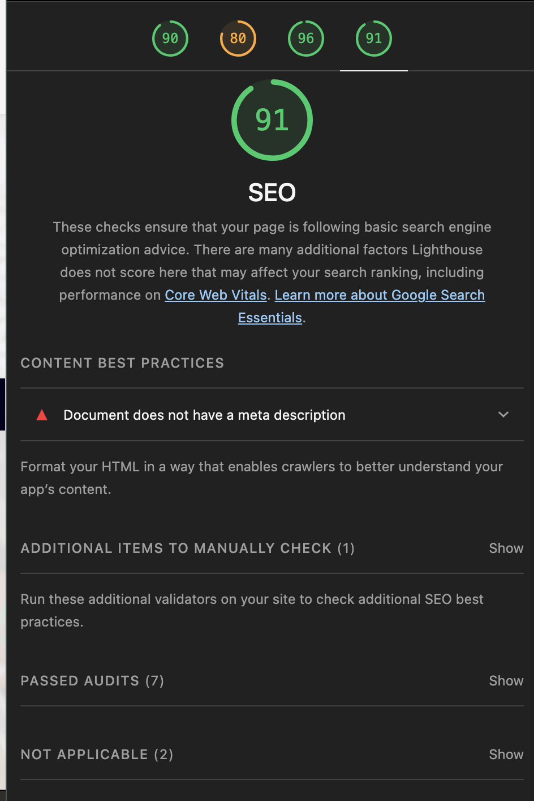 |

### **3. Auditoría Técnica con axe DevTools**

Para finalizar la fase de diagnóstico, se utilizó axe DevTools, una herramienta centrada en la validación técnica del código y el cumplimiento estricto de WCAG 2.1.

**Observaciones:**

- **Total de problemas:** 18 (17 Graves, 1 Moderado).

- **Problemas de Contraste:** 9 incidencias. Se identifica específicamente el color `#ea4634` (Naranja corporativo) sobre fondo claro `#f5f5f5`, dando un ratio de 3.55:1 (insuficiente para WCAG AA).

- **Semántica HTML:** Se detectó un error grave en la construcción del menú de navegación.
  - **Error:** `<ul>` y `<ol>` contienen hijos directos que no son `<li>`.
  - **Causa:** Los enlaces `<a>` están envolviendo a los ítems de lista `<li>` (`<ul> > a > li`), lo cual es HTML inválido.

- **Encabezados:** Confirma la ausencia de `<h1>` en la página.

### **Evidencias**

Como respaldo al informe técnico, se adjuntan las capturas de pantalla generadas por la herramienta, donde se detallan las incidencias de semántica y contraste.

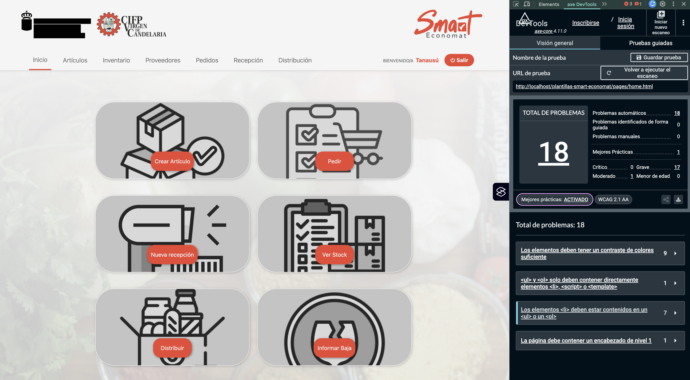

|          Detalle Contraste           |           Error en Listas            |            Contenedor ul             |             Falta de H1              |
| :----------------------------------: | :----------------------------------: | :----------------------------------: | :----------------------------------: |
| 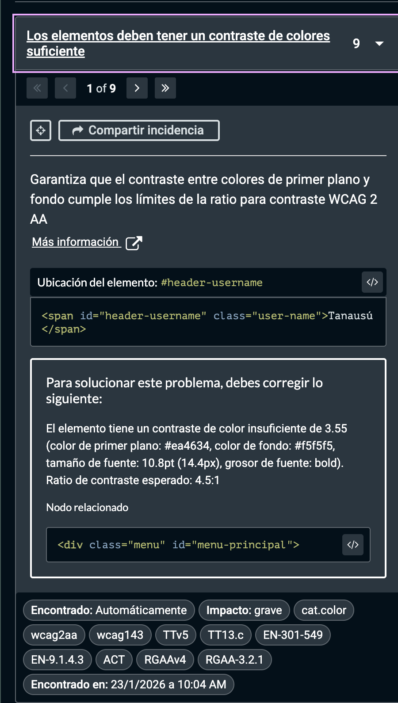 | 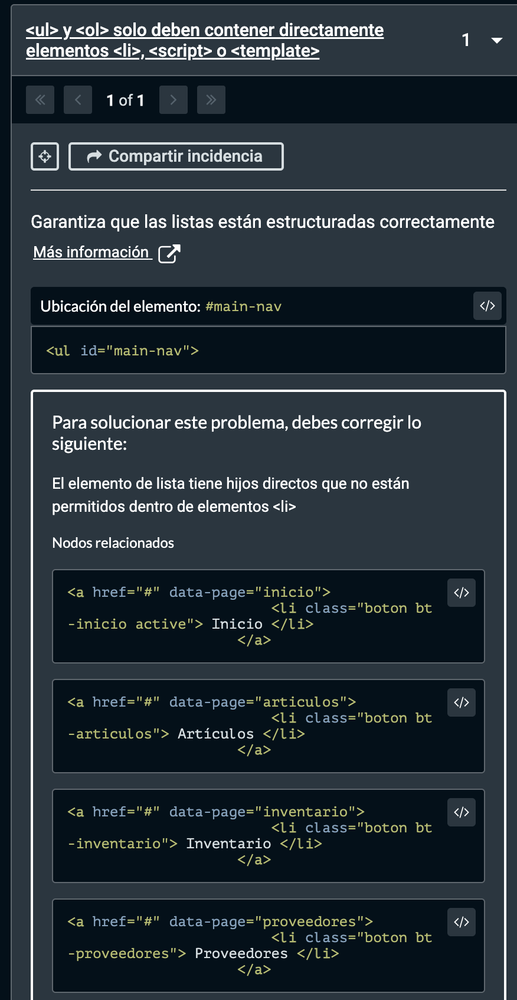 | 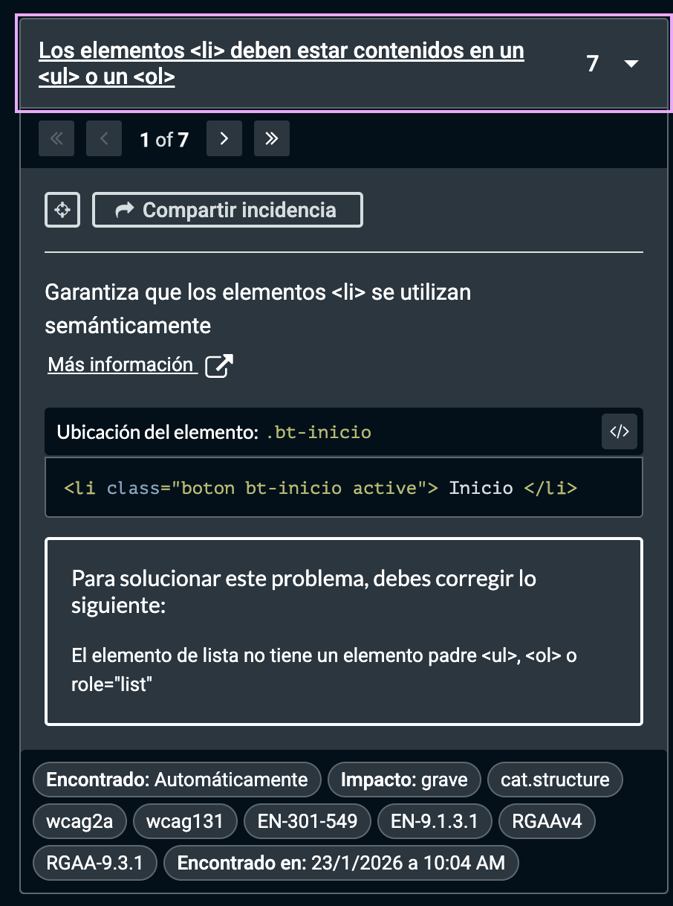 | 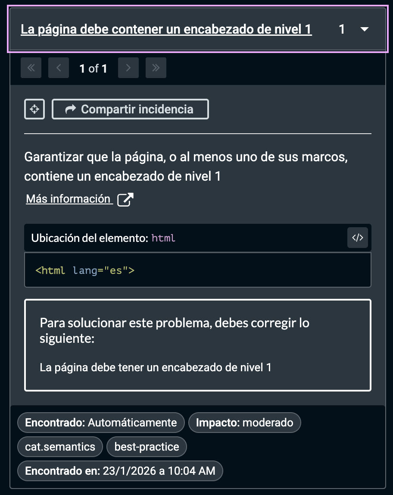 |

# **Fase 2: Mejora de la accesibilidad perceptible**

**Objetivo:** Garantizar que la información y los componentes de la interfaz sean perceptibles para todos los usuarios, independientemente de sus capacidades visuales.

### **1. Corrección de Contraste**

**Problema detectado:**
Durante la auditoría inicial, se identificó que varios colores corporativos no cumplían con el ratio mínimo de contraste exigido por las WCAG 2.1. Específicamente, el color primario (`#ea4634`) sobre fondo blanco presentaba un ratio de **3.55:1** (Fallo en nivel AA).

**Solución aplicada:**
Se han redefinido las variables CSS globales para oscurecer los tonos y maximizar la legibilidad sin perder la identidad de marca.

**Cambios realizados:**

- **Color Primario (Botones y textos):**
  - Anterior: `#ea4634`
  - Nuevo: `#922320`
  - **Resultado:** Ratio superior a **7:1** (Cumple Nivel **AAA**).

- **Color Secundario (Enlaces del footer):**
  - Anterior: `#3ad6c4`
  - Nuevo: `#35dbc8`
  - **Resultado:** Mejora significativa en la legibilidad sobre fondo oscuro.

**Validación y Herramientas:**
Se utilizó la herramienta **WhoCanUse** para validar los nuevos ratios. Esta herramienta permitió no solo verificar los datos matemáticos, sino simular la visión de personas con distintos tipos de daltonismo, asegurando que los elementos interactivos sean distinguibles para todos los usuarios.

**Evidencias de la corrección:**

| Pruebas de contraste (Color Primario) |    Pruebas de contraste (Footer)     |
| :-----------------------------------: | :----------------------------------: |
| 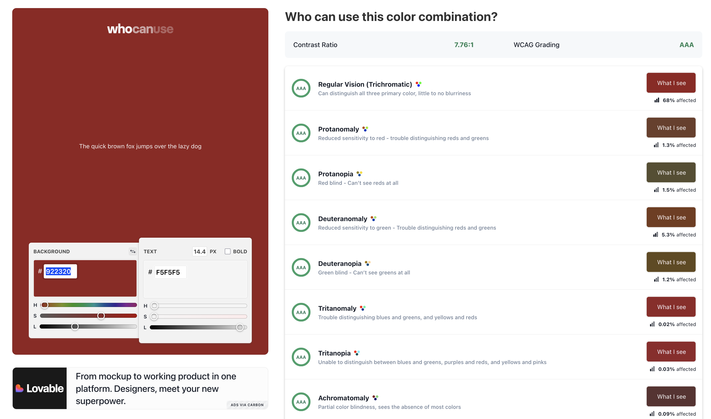  | 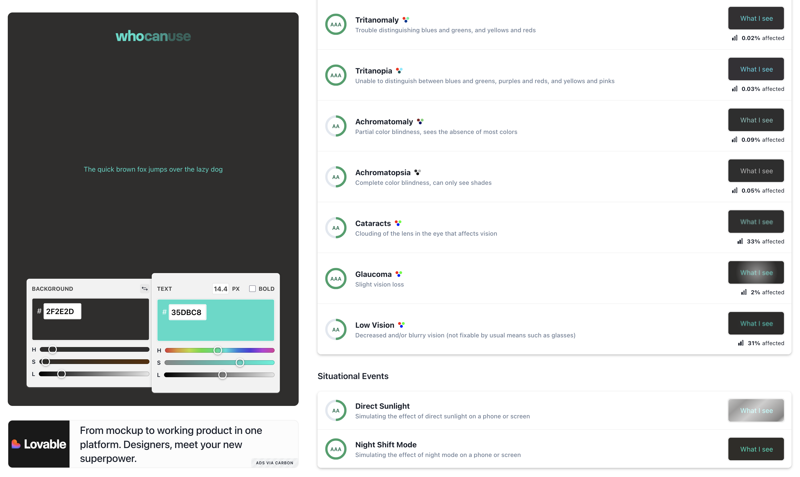 |

### **2. Corrección de Semántica HTML**

**Problemas detectados:**

1.  **Menú de navegación inválido:** La herramienta **axe DevTools** identificó que la lista `<ul>` contenía elementos `<a>` como hijos directos, lo cual viola el estándar HTML y rompe la navegación secuencial para lectores de pantalla.
2.  **Ausencia de título principal:** No existía ningún encabezado de nivel 1 (`<h1>`), impidiendo identificar el propósito principal de la página mediante navegación por jerarquías.

**Soluciones aplicadas:**

- **Reestructuración del Menú:**
  Se invirtió el anidamiento para cumplir el estándar W3C.
  - _Incorrecto:_ `<ul> > <a> > <li>`
  - _Corregido:_ `<ul> > <li> > <a>`
    Además, se trasladaron las clases de estilo al enlace `<a>` para asegurar que el área interactiva ocupe todo el botón.

- **Encabezado Invisible H1:**
  Se solucionó la falta de título principal añadiendo un `<h1>` con la clase `.sr-only`, visible solo para lectores de pantalla, asegurando que la jerarquía del documento comience correctamente en el nivel 1.

  ```
  <h1 class="sr-only">Gestión de Economato - CIFP Virgen de Candelaria</h1>
  ```

**Resultado:**
El código ahora pasa la validación de estructura de **WAVE** y **axe DevTools**, eliminando los errores críticos de semántica.

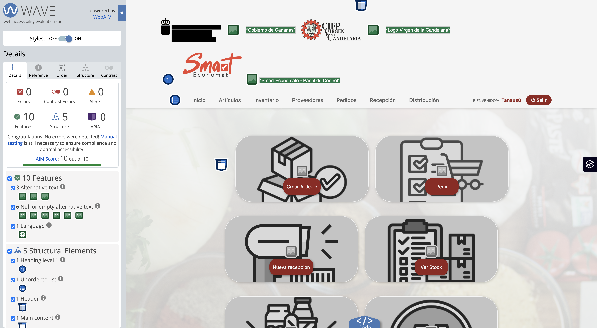

# **Fase 3: Mejora de la accesibilidad operable**

**Objetivo:** Permitir que la aplicación pueda usarse sin necesidad de un ratón, garantizando el acceso mediante teclado.

### **1. Validación de Navegación por Teclado**

**Metodología:**
Se realizó una auditoría manual en la página principal (`home.html`) utilizando exclusivamente las teclas `TAB` (avanzar), `SHIFT + TAB` (retroceder) y `ENTER` (activar).

**Resultados de la prueba:**

- **Visibilidad del Foco:**

  El navegador renderiza un indicador visual (outline azul predeterminado) alrededor del elemento activo, permitiendo al usuario saber siempre dónde se encuentra.

- **Orden Lógico de Tabulación:**

  El foco sigue una secuencia coherente con la lectura visual:
  1.  Menú de Navegación en sentido correcto (Izquierda a derecha).
  2.  Botón de cierre de sesión.
  3.  Botones de acceso directo en las Tarjetas centrales.
  4.  Enlaces del pie de página.

- **Operabilidad:**
  Todos los elementos interactivos (enlaces de navegación y botones de acción) responden al evento de teclado `ENTER`, ejecutando la acción esperada (redirección o cierre de sesión).

Por tanto la página principal cumple con el criterio de operabilidad gracias al uso correcto de etiquetas semánticas HTML (`<a>`, `<button>`), sin necesidad de aplicar parches ARIA o JavaScript adicional para la navegación básica.

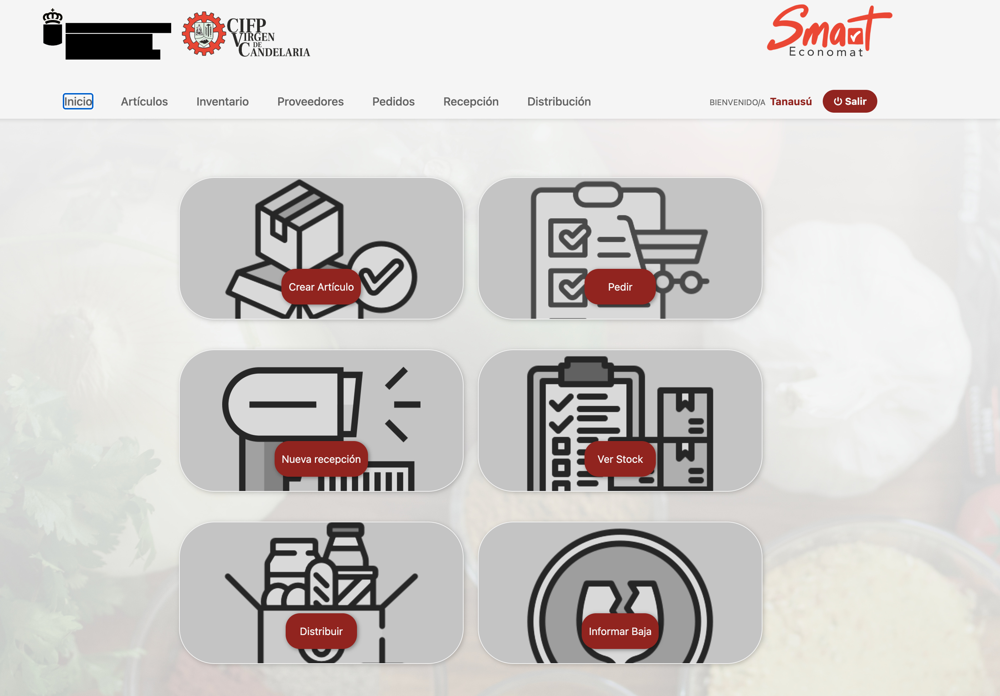

# **Fase 4: Mejora de la accesibilidad comprensible**

**Objetivo:** Facilitar la comprensión del contenido y asegurar que el navegador interprete correctamente el idioma de la página.

### **1. Definición de Idioma y Etiquetas**

**Verificación:**

- **Idioma del Documento:**
  La etiqueta raíz `<html lang="es">` está definida explícitamente. Esto permite que los lectores de pantalla carguen la síntesis de voz en español automáticamente y realicen la corrección ortográfica adecuada.

  ```
  <!doctype html>
  <html lang="es">
  ```

- **Claridad en Controles:**
  Se ha verificado que los botones que utilizan iconos (como el de "Salir") incluyen atributos textuales de apoyo.
  - _Elemento:_ Botón de Logout.
  - _Atributo:_ `title="Cerrar Sesión"`.
  - _Beneficio:_ Proporciona una etiqueta accesible que aclara la función del botón más allá del texto visual "Salir".

```
    <button id="btnLogout" class="bt-logout" title="Cerrar Sesión">
              ⏻ Salir
    </button>
```

# **Fase 5: Mejora de la accesibilidad robusta**

**Objetivo:** Asegurar la compatibilidad con tecnologías de apoyo actuales y futuras mediante el uso estricto de estándares web semánticos y especificaciones ARIA.

### **1. Auditoría de Estructura Semántica**

**Estado inicial:**
Se verificó el código fuente del proyecto (`home.html`), confirmando que la estructura base ya cumplía parcialmente con los estándares de HTML5. Las regiones principales estaban correctamente definidas mediante las etiquetas:

- `<header>`: Para la cabecera y logotipos.
- `<main>`: Para el contenedor del contenido principal.
- `<footer>`: Para el pie de página y créditos.

**Deficiencia detectada:**
A pesar de la correcta estructura general, se identificó que el **menú de navegación** estaba implementado mediante un contenedor genérico (`div`), rompiendo la cadena semántica y ocultando esta región clave a los lectores de pantalla.

### **2. Correcciones y Mejoras de Robustez**

Para perfeccionar la estructura y garantizar la robustez, se aplicaron las siguientes mejoras:

- **Implementación de `<nav>`:**
  Se sustituyó el `div` de la navegación por la etiqueta semántica `<nav>`. Esto permite que el navegador exponga correctamente el rol "navigation" al árbol de accesibilidad.

- **Etiquetado de Regiones:**
  Aunque las etiquetas `main` y `footer` ya existían, se les añadieron atributos `aria-label` para desambiguar su propósito en contextos de lectura rápida:
  - `<nav aria-label="Principal">`: Diferencia esta navegación de otras listas de enlaces.
  - `<footer aria-label="Información legal">`: Describe el contenido del pie de página.

**Resultado:**
La aplicación cuenta ahora con una estructura 100% semántica, validada tanto por herramientas automáticas como por la inspección de código manual.

# **Fase 6: Pruebas con lectores de pantalla y validación manual**

**Objetivo:** Verificar la experiencia de usuario real utilizando herramientas de simulación de lectores de pantalla, detectando problemas semánticos y de contexto que las auditorías automáticas no pueden identificar.

### **1. Metodología de Prueba**

Para esta fase, se prescindió del ratón y se utilizó la herramienta **Silktide** que tiene una opción de simulador de lector de pantalla para navegar por la interfaz auditiva. El objetivo fue comprobar si el orden de lectura, la identificación de regiones y los nombres de los controles eran comprensibles sin referencias visuales.

### **2. Problemas Detectados y Correcciones**

Durante la navegación simulada, se identificaron cuatro problemas críticos de experiencia de usuario que fueron corregidos inmediatamente:

#### A. Ausencia de Región de Navegación ("Div Soup")

- **Problema:** El lector de pantalla no anunciaba la región del menú principal. Al estar envuelto en un `<div>`, el lector lo interpretaba como texto plano, obligando al usuario a recorrer todos los enlaces uno por uno para saber qué eran.
- **Corrección:** Se sustituyó el contenedor `<div>` por la etiqueta semántica `<nav>`.
- **Resultado:** El lector ahora anuncia _"Entered navigation"_ (Entrando en navegación), permitiendo al usuario saltar directamente a esta zona o saltársela si lo desea.

#### B. Inconsistencia Semántica en SPA (Single Page Application)

- **Problema:** Se detectó que asignar una etiqueta específica (`aria-label="Accesos directos"`) al contenedor `<main>` era un error en una arquitectura SPA. Al navegar a otras vistas (como Pedidos o Inventario), la etiqueta "Accesos directos" persistía aunque el contenido hubiera cambiado, confundiendo al usuario.
- **Corrección:** Se asignó una etiqueta genérica `aria-label="Contenido principal"` al contenedor maestro.
- **Estrategia:** La identificación del contexto específico se delega ahora a los encabezados (`<h2>`) que se cargan dinámicamente dentro de cada vista.

**aria-label para el main**

```
<main id="contenido" aria-label="Contenido principal">
```

**<h2> para identificar las páginas internas dentro del main**

```
<h2 class="sr-only">Accesos directos</h2>
```

#### C. Ausencia de Título de Página (H1)

- **Problema:** El usuario auditivo no recibía confirmación del nombre de la aplicación al cargar la página.
- **Corrección:** Se implementó un `<h1>` con la clase `.sr-only`, visible solo para lectores de pantalla.
- **Resultado:** El lector anuncia _"Heading 1 - Smart Economato - Panel de Control Principal"_ al inicio de la navegación.

### **3. Resultado final**

La prueba manual evidenció que un código HTML visualmente correcto puede ser inutilizable auditivamente. La implementación de las etiquetas semánticas (`nav`, `main`) y los atributos ARIA correctos transformaron una lista de enlaces desordenada en una interfaz estructurada y navegable por regiones.

### **4. Evidencias de Validación**

A continuación se muestra la captura del simulador Silktide reconociendo correctamente la región de navegación y leyendo la lista de elementos tras las correcciones aplicadas.

|           Lectura de _h1_            |          Lesctura del _nav_          |      lectura de _link_ (footer)      |
| :----------------------------------: | :----------------------------------: | :----------------------------------: |
| 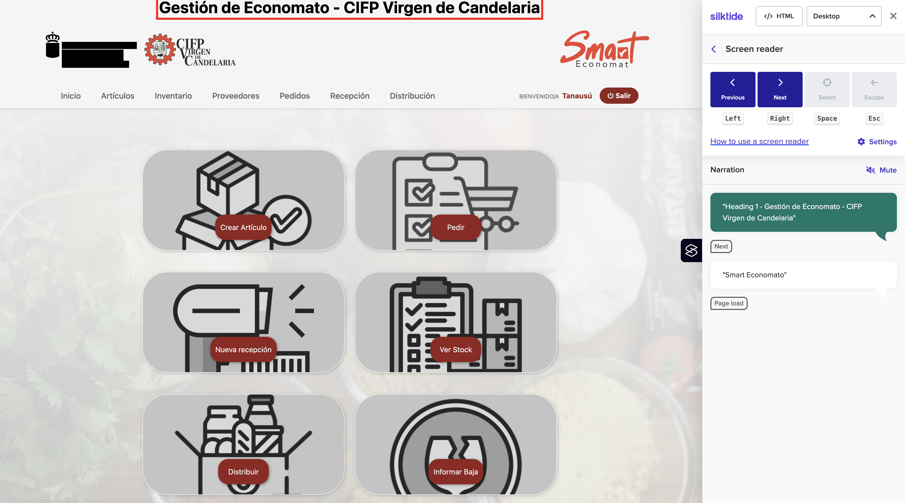 | 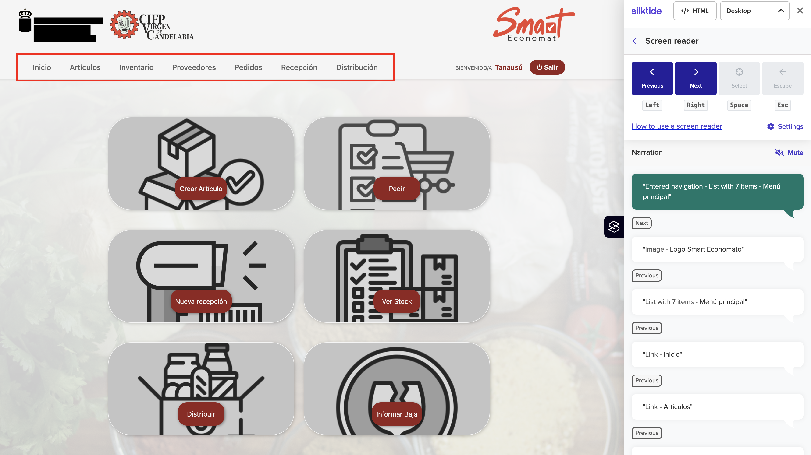 | 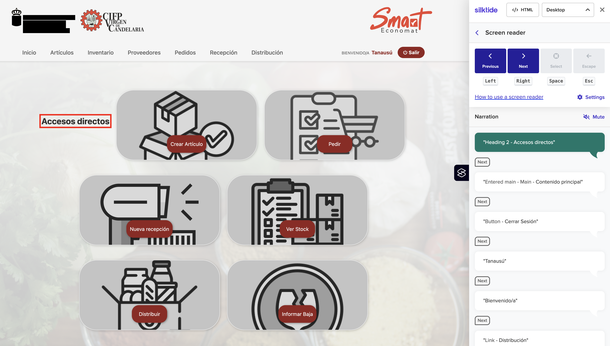 |

# **Fase 7: Auditoría Final y Validación**

**Objetivo:** Verificar que, tras la implementación de las medidas correctoras (Fases 2-6), la aplicación cumple rigurosamente con los estándares técnicos exigidos.

### **1. Validación Estructural**

Se realizó un escaneo final sobre el archivo `home.html` refactorizado. La herramienta certifica la ausencia total de incidencias.

- **Errores:** 0
- **Errores de Contraste:** 0
- **Alertas:** 0
- **Estructura:** Se validó la correcta jerarquía de encabezados (`h1`, `h2`) y regiones semánticas.

**Evidencia:**

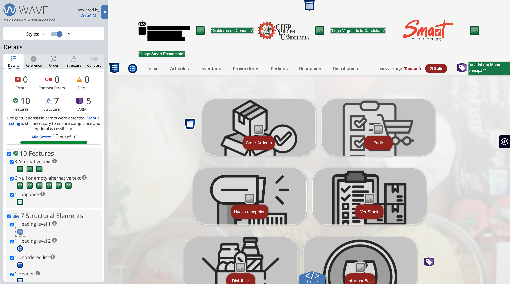

### 2. Validación de Rendimiento

La auditoría de Google Chrome Lighthouse confirma la optimización total, alcanzando la máxima puntuación posible.

- **Puntuación Accesibilidad:** **100/100**
- **Verificaciones superadas:** Navegación por teclado, etiquetado ARIA, contraste de color y nombres accesibles.

**Evidencia:**
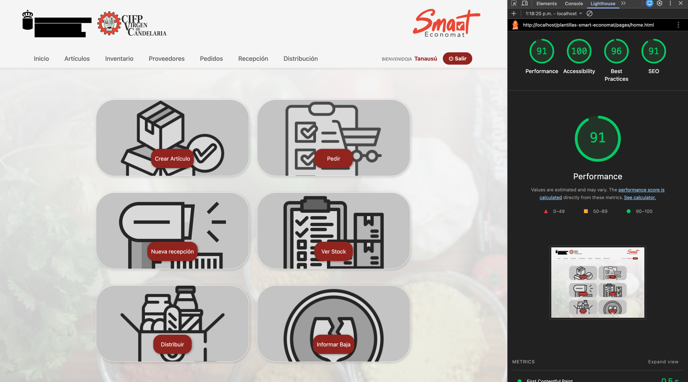

### 3. Validación de Motor de Reglas

Como medida de control de calidad adicional, se ejecutó el motor de análisis `axe-core`.

- **Total de problemas:** 0
- **Cumplimiento:** WCAG 2.1 AA y mejores prácticas recomendadas.

**Evidencia:**
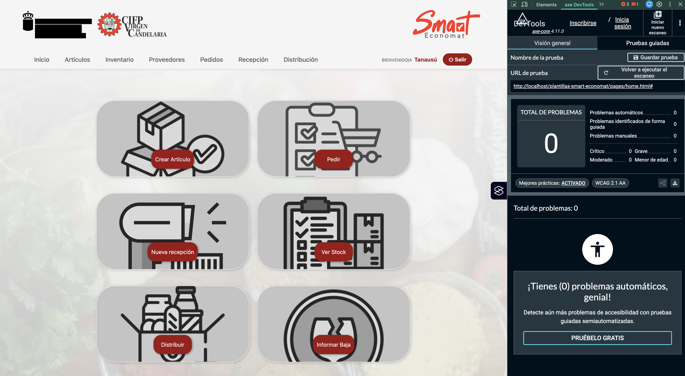

---

# Conclusiones del Proyecto

La intervención realizada en la aplicación Smart Economato ha permitido transformar una interfaz con barreras de acceso significativas en un producto web inclusivo, robusto y con buenas prácticas.

**Resumen de Logros:**

1.  **Perceptibilidad (Nivel AAA):** Corrección total de la paleta de colores, garantizando ratios de contraste superiores a 7:1 para una legibilidad óptima.
2.  **Robustez Semántica:** Migración de una estructura basada en `<div>` a HTML5 semántico (`nav`, `main`, `header`), permitiendo la correcta interpretación por parte del Árbol de Accesibilidad del navegador.
3.  **Experiencia de Usuario Inclusiva:** Solución de problemas de contexto auditivo detectados mediante pruebas manuales con lectores de pantalla.
4.  **Operabilidad Total:** Garantía de navegación 100% funcional mediante teclado, ideal para usuarios con discapacidad motora.

**Estado Final:**
La página de inicio (`home.html`) cumple satisfactoriamente con los Criterios de Conformidad de las **WCAG 2.1**, validada mediante una triangulación de herramientas líderes en la industria (WAVE, Lighthouse y Axe).
